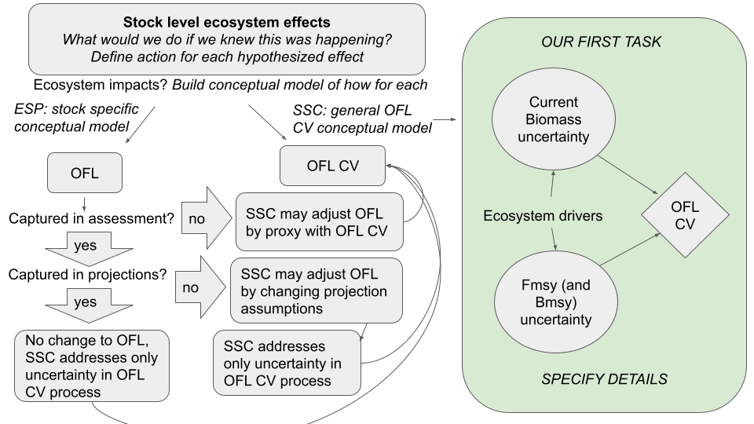
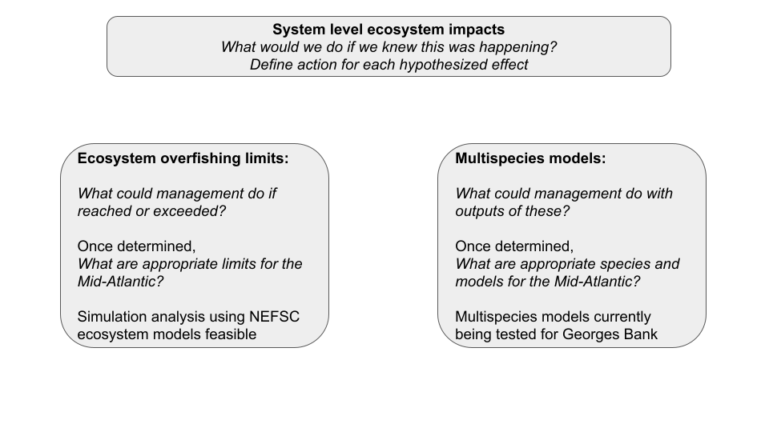
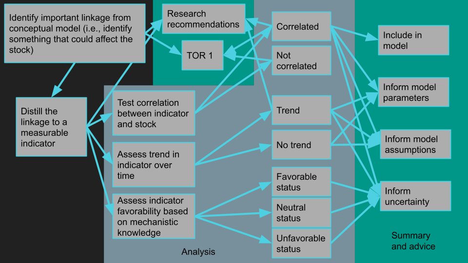

```{r setup, include=FALSE}
knitr::opts_chunk$set(echo = FALSE,
                      message = FALSE,
                      warning = FALSE,
                      dev = "cairo_pdf",
                      fig.align = 'center') #allows for inserting R code into captions

library(tidyverse)
#library(readxl)
#library(kableExtra)
library(ecodata)
#library(googledrive)
#library(pacman)
#p_load(repmis, RCurl, DT, magrittr, gsubfn, stringr, tidyverse)

```

```{r, code = readLines("https://raw.githubusercontent.com/NOAA-EDAB/ecodata/master/chunk-scripts/macrofauna_MAB.Rmd-setup.R")}
```

The MAFMC SSC Ecosystem Working Group (WG) was established in May  2021 to assist the Council in developing short term and long term objectives to advance the operational use of ecosystem information in management decisions. As reported in [September 2021](https://www.mafmc.org/s/b_Ecosystem-WG_Proposed-Tasks-August-2021.pdf), the WG has identified three general objectives: 

1.  Expanding and clarifying the ecosystem portion of the SSC OFL CV determination process (short term objective)
1.  Developing prototype processes to provide multispecies and system level scientific advice appropriate for Council decision making, in particular where there are multispecies and multifleet tradeoffs linking directly to economic and social outcomes (long term objective)
1.  Collaborating with SSC species leads, stock assessment leads, and relevant working groups in developing the stock-specific Ecosystem and Socio-economic Profiles (ESP) process to specify stock-specific Ecosystem ToRs that are impactful and can be integrated into assessments (moderate-term objective)

Objectives 1 and 3 aim to integrate appropriate ecosystem information at the stock level of management decision making, while objective 2 applies to current Council EAFM processes and potential future multispecies and system level objectives. 

Intended outcomes of WG work for the Council include:
*  An OFL CV process that makes better use of ecosystem information in determining the ABC
*  Evaluation of multiple ecosystem indicators and potential development of thresholds for use in a revised EAFM risk assessment and/or other Council processes
*  Increased range of opportunities for relevant ecosystem information to be considered in management decision processes

The WG has met four times since September 2021 (October, November, December 2021 and January 2022) to outline the following work plans for each objective.

## Ecosystem criteria for OFL CV determination

The WG focused on this objective in all four meetings. An initial step was outlining an SSC decision process for evaluating stock level ecosystem effects (Fig. \ref{fig:OFLCV}).

```{r OFLCV, fig.cap="SSC process for incorporating ecosystem information into OFL CV decisions.", out.width="100%"}

```

The WG outlined decisions for OFL CV centered on management responses. How would we manage differently if we knew the following attributes of a stock were changing?  
*  M is increasing/decreasing
*  Recruitment is in a low/high regime
*  Growth rates are increasing/decreasing
*  Fish are maturing earlier/later age or smaller/larger size
*  Sex ratio is changing
*  Spatial distribution is changing

Other considerations are: Over what timeframe is change observed? Can we expect change to continue? Overall, to the extent possible the goal is to link changes to specific ecosystem factors to tease out expectations.

The WG outlined next steps and is currently designing analyses to address a subset of these questions. 

*  Flesh out OFL CV conceptual model (Fig. \ref{fig:OFLCV}) as it relates to these and other parameters
*  Use Wiedenmann MSE framework to evaluate impact of changes in these parameters on OFL (assessment and projection) and or OFL CV, and performance of current HCR over multiple stocks already included in that model
*  Continue coordination with stock-specific conceptual model development and current assessments through research track working groups/ESP process

At the January 2022 meeting, WG member Mike Wilberg reported that he (and students, UMD) will collaborate with John Wiedenmann (and students, Rutgers) to implement the MSE framework for 2 species to start, focusing on recruitment as the response. Summer flounder and Atlantic Mackerel are proposed, with the groups to start with summer flounder. The plan was to start towards the end of February 2022 with the students by introducing the project, what the overall goals are, and get them up to speed on code. Initial tasks include updating the MSE model with recent stock assessment information. The WG discussed what scenarios to run, and what kind of climate forcing to use. The students will be invited to present to the WG and join discussions as the project progresses.


## Ecosystem indicator evaluation and threshold analyses

The WG outlined general themes for this objective at all meetings, but began discussing them in earnest at the January 2022 meeting. Initial thoughts for ecosystem and multispecies level indicator evaluation were outlined in October-November 2021 (Fig. \ref{}fig:multispp).

```{r multispp, fig.cap="SSC outline incorporating ecosystem information into multispecies and ecosystem decisions.", out.width="100%"}

```

These tasks would require engagement with and guidance from the Council. Funding has recently been secured within NEFSC to support these analyses; Andy Beet (NEFSC), an experienced statistician and modeler who currently contributes to the SOE, will work with the SSC and attend WG meetings. While tasks have yet to be outlined, there are several analyses that would address previous SSC and Council requests related to EAFM and the SOE.

*  For EAFM risk assessment, tasks could include
    +  Develop additional risk elements
    +  Review and improve current indicators, risk criteria and identify potential thresholds
    +  WG noted this could also feed back into OFL CV ecosystem criteria
*   Developing future decision making processes making best use of ecosystem (including social and economic) information could include
    +  Ecosystem level reference points
    +  Multispecies decisions/reference points

At the January 2022 meeting, the WG reviewed example multispecies indicators, including the stock productivity indicator in the SOE (Fig. \ref{fig:productivity-anomaly}) and similar indicators based on recent stock assessments (https://sgaichas.github.io/stockstatusindicator/MultisppRec.html). 

```{r productivity-anomaly, fig.cap = "Small fish per large fish biomass anomaly in the Mid-Atlantic Bight. The summed anomaly across species is shown by the black line.", code=readLines("https://raw.githubusercontent.com/NOAA-EDAB/ecodata/master/chunk-scripts/macrofauna_MAB.Rmd-productivity-anomaly.R"), fig.width=5, fig.asp=.7}

```

The ecosystem overfishing (EOF) indicators presented in the 2021 SOE have been subject to several requests from both Councils for additional analysis, including impacts of changes in phytoplankton community composition, evaluation and comparison of theoretical and empirical thresholds, and evaluation of ecosystem optimum yield (see 2022 [SOE Request Memo](https://www.mafmc.org/s/b_SOE-Cover-letter-and-request-memo.pdf)). The WG requested a detailed presentation of the current EOF indicators at an upcoming meeting. 

## Collaboration with assessment working groups/ESP process

WG members are involved with the *Illex* (Paul Rago), black sea bass (Gavin Fay), and bluefish (Sarah Gaichas) research track assessment working groups and ecosystem ToRs/ESP processes. 

The ESP is intended to provide "a structured framework to incorporate ecosystem and socioeconomic information into stock advice" (Abby Tyrell, NEFSC, presentation to the Bluefish research track WG, November 2021). The framework identifies important bottlenecks in the stock's life history using literature review and conceptual modeling, identifies and tests indicators linking ecosystem and socioeconomic conditions and stock performance, and assesses whether conditions are favorable for the stock based on the indicators. The ESP is intended to be included with the stock assessment document as an appendix to the report.

The framework can be linked with assessment ToRs, as demonstrated by Abby in Fig. \ref{fig:ESPex}).

```{r ESPex, fig.cap="Example flow of information in the bluefish ESP, Abby Tyrell, November 2021", out.width="100%"}


```

The WG notes that ESP information can be used by the SSC in many ways. Even if not specifically included in the assessment model, ESP indicators could provide critical information regarding stock implications and processes within an ecosystem context. 

More detailed information on the ESP process can be provided to the SSC at a future meeting. 

The WG welcomes full SSC discussion of the points raised in this report, and invites any other members to participate at any time. The next meeting is tentatively scheduled for April 2022.


