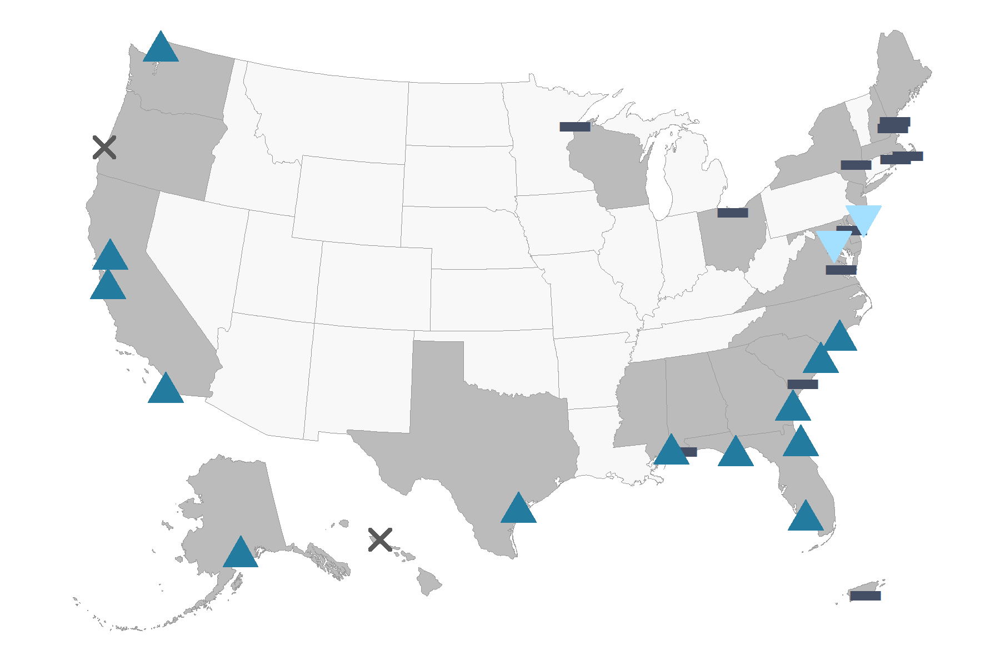
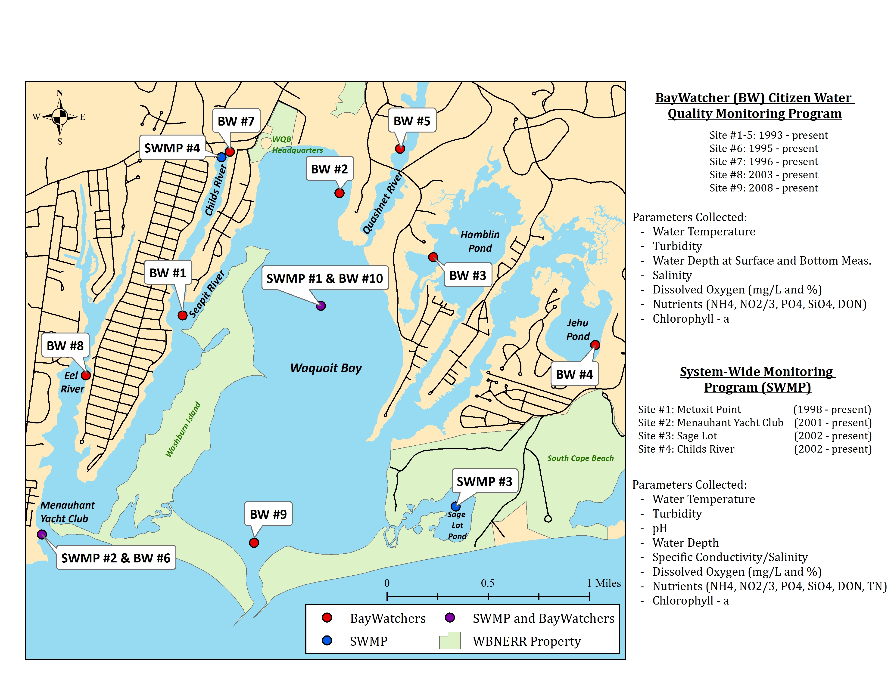
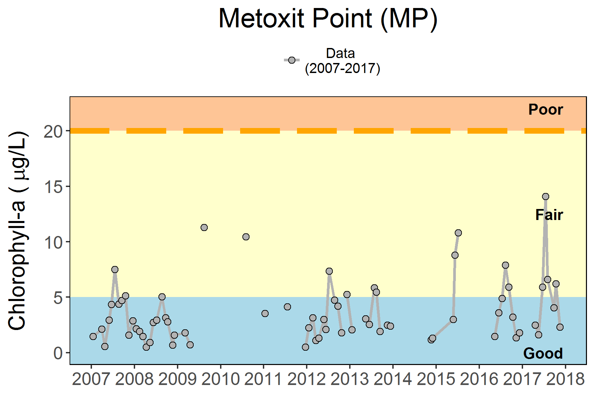
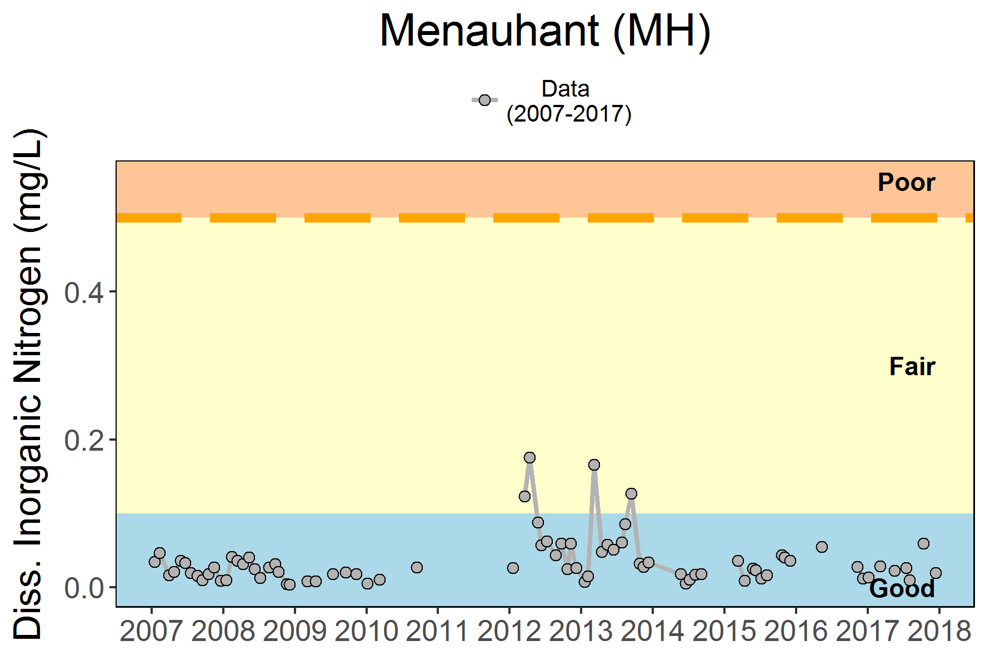
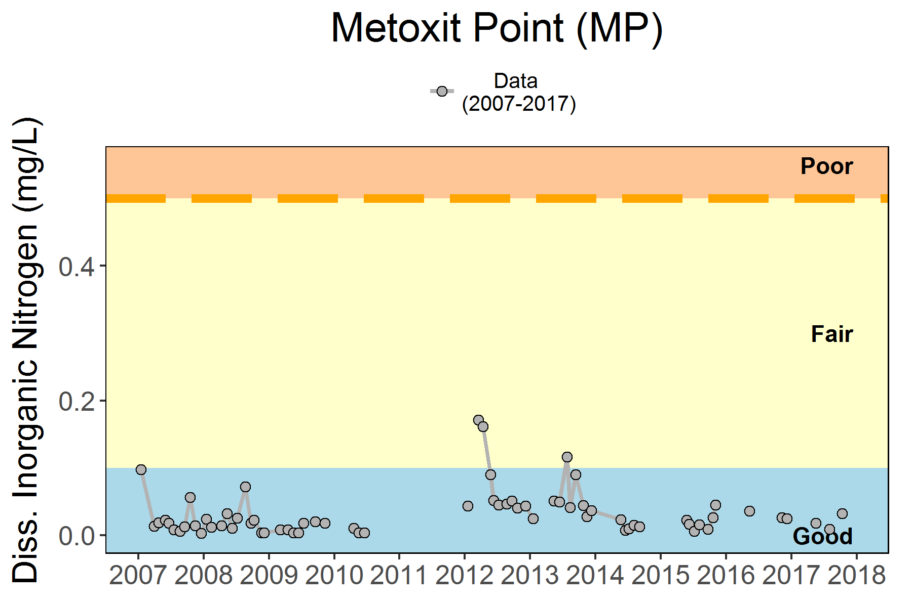
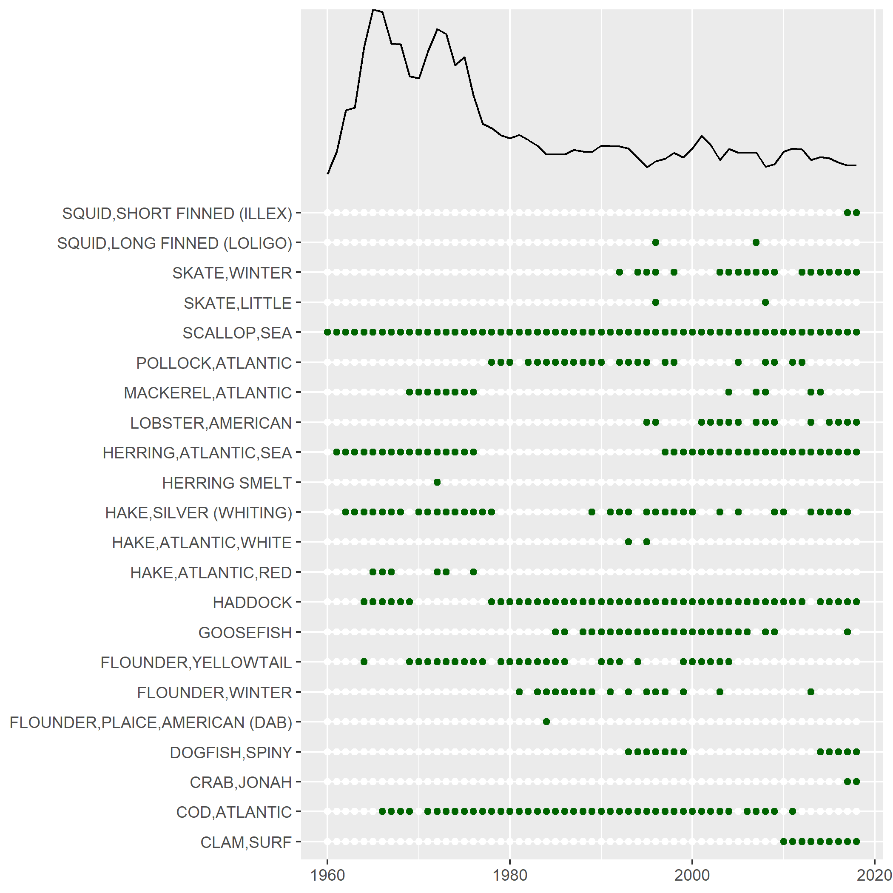
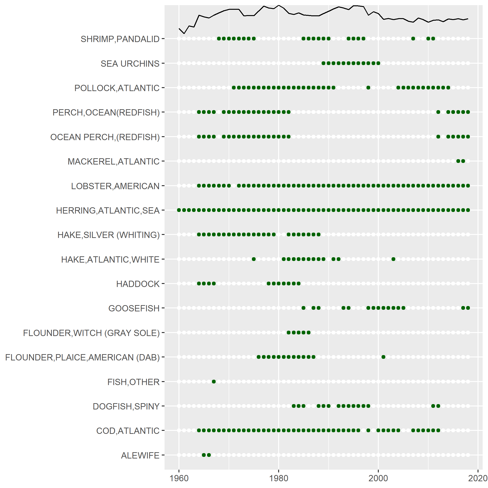

---
title:
geometry: left=2cm, right=2cm, top=2cm, bottom=3cm, footskip = .5cm
output: 
  pdf_document:
    includes:
      in_header: latex/header.tex
    keep_tex: yes
bibliography: SOE2020.bib
csl: plos.csl
link-citations: yes
fontsize: 10pt
subparagraph: yes
---

```{r setup, include=FALSE}
#Default Rmd options
knitr::opts_chunk$set(echo = FALSE,
                      message = FALSE,
                      warning = FALSE,
                      dev = "cairo_pdf",
                      fig.align = 'center') #allows for inserting R code into captions

library(tidyverse)
library(readxl)
library(kableExtra)
library(ecodata)

```

```{r setupfigs, include=FALSE}
#Time series constants
shade.alpha <- 0.3
shade.fill <- "lightgrey"
lwd <- 1
pcex <- 2
trend.alpha <- 0.5
trend.size <- 2
hline.size <- 1
hline.alpha <- 0.35
hline.lty <- "dashed"
label.size <- 5
hjust.label <- 1.5
letter_size <- 4
feeding.guilds1<- c("Piscivore","Planktivore","Benthivore","Benthos")
feeding.guilds <- c("Apex Predator","Piscivore","Planktivore","Benthivore","Benthos")
x.shade.min <- 2009
x.shade.max <- 2019
#Function for custom ggplot facet labels
label <- function(variable,value){
  return(facet_names[value])
}
```


```{r, include = F}
#this is to wrap text around figures if we want
defOut <- knitr::knit_hooks$get("plot")  # save the default plot hook 
knitr::knit_hooks$set(plot = function(x, options) {  # set new plot hook ...
  x <- defOut(x, options)  # first apply the default hook
  if(!is.null(options$wrapfigure)) {  # then, if option wrapfigure is given ...
    # create the new opening string for the wrapfigure environment ...
    wf <- sprintf("\\begin{wrapfigure}{%s}{%g\\textwidth}", options$wrapfigure[[1]], options$wrapfigure[[2]])
    x  <- gsub("\\begin{figure}", wf, x, fixed = T)  # and replace the default one with it.
    x  <- gsub("{figure}", "{wrapfigure}", x, fixed = T)  # also replace the environment ending
  }
  return(x)
})
```

# Introduction

In the table below we summarize all comments and requests with sources. The Progress column briefly summarizes how we responded, with a more detailed response in the numbered Memo Section. In the Progress column, "SOE" indicates a change included in the report(s).

```{r summtable}
# take from google drive to automatically update any changes
#googledrive::drive_download("Northeast IEA/State of the Ecosystem Reports/SOE 2020/Workshop & Meeting Notes/Request checklist", path="2019requests.xlsx", overwrite = TRUE)

requests <- read_excel("2019requests.xlsx", sheet="MemoTable", range = 'A1:D31')

#requests$`Memo Section` <- paste0("[", requests$`Memo Section`, "](#",requests$`Memo Section`,")") #trying to make clickable links in the table to sections, not working
#adding format = "markdown" to kable statement made them links but they still didnt jump to report sections and messed up other formatting

knitr::kable(requests, longtable = T, booktabs = TRUE, linesep = "") %>%
  kable_styling(font_size=9, latex_options = c("hold_position", "striped", "repeat_header")) %>%
  row_spec(0,bold=TRUE) %>%
  column_spec(1, width="5cm") %>%
  column_spec(2, width="2cm") %>%
  column_spec(3, width="5cm") %>%
  column_spec(4, width="2cm")
```


# Responses to comments

## 1 

Both Councils asked for a summary "report card" similar to that used in Alaska [@zador_ecosystem_2016]. The first page of this year's SOE reports summarizes the key messages with icons showing the message theme (e.g., commercial fisheries, fishing communities, forage species, system productivity, etc). At present, we synthesized key findings on both existing and new indicators. We welcome suggestions for indicators that should always be tracked in this section, and for further refinements to make this summary more useful.

## 2 

Both Councils asked for a summary visualization. The first page of the SOE report uses icons developed to help visualize different report components. The second page of this year's SOE report has both a map visualizing the key oceanographic features mentioned in the report along with fishing communities, and a conceptual model visualizing potential linkages between report indicators. The conceptual model is discussed further under point 5 below.

## 3

Both Councils asked for uncertainty estimates to be included with indicators. As a first step, we included survey design-based uncertainty estimates^[https://noaa-edab.github.io/tech-doc/survdat.html] for all surveys where we had haul specific information (all but the inshore ME-NH survey). Including this uncertainty led to a different approach to the data, looking for true departures from expected stable dynamics at the functional group level, and provided insight into which trends were potentially noteworthy. Survey biomass uncertainty is included in each SOE (p. MAFMC and p. NEFMC).

We experimented with a model-based estimate of uncertainty for survey biomass which accounts for both spatial and temporal sources (VAST; @thorson_guidance_2019). The results are promising (Fig. \ref{fig:VASTtest}), and may serve not just as a biomass indicator but also an indicator of distribution shifts for species and functional groups. This method can also potentailly combine the inshore and offshore surveys into a single analysis. If the SSCs and Councils consider this approach promising, we will persue it further for next year. 

```{r VASTtest, fig.cap="Georges Bank piscivoves biomass and uncertainty as estimated by the VAST model.", fig.show='hold', out.width='49%'}

knitr::include_graphics("images/ln_density.png")
knitr::include_graphics("images/biomass_plot.pdf")

```

Some indicators (e.g. total landings) may have uncertainty which is difficult to calculate (e.g. based on unknown reporting errors). Many other current indicators do not have straightforward uncertainty calculaltions (e.g. diversity indices, anomalies) so we welcome suggestions from the SSC and Council to guide estimation for future reports.

## 4

The NE SSC asked to include downeast ME in future reports, because the Scotian Shelf EPU which includes downeast ME has not been included in previous reports. We felt it was inappropriate to report on the Scotian Shelf EPU, which includes Canadian waters and is an incomplete portion of the full Soctian Shelf. However, this year we recalculated survey biomass using an updated strata set that includes much of downeast ME for the NEFSC (Fig. \ref{fig:survbio-strata}; p. NEFMC SOE). The inshore strata not included in the NEFSC trawl survey biomass are represented in the ME-NH survey (p. NEFMC SOE) Further, fishery catch and revenue data, fishing community data, and recreational indicators have always included downeast ME because both fishing statistical areas and human community data include all of ME. Therefore, fishery and fish biomass information reflects much of the area. 

```{r survbio-strata, fig.cap="Survey strata mapping to EPUs for biomass estimates", out.width='80%'} 
#,  fig.align="right", wrapfigure = list("R", .5)
knitr::include_graphics("images/EPU_Designations_Map.jpg")
```

Oceanographic indicators (surface and bottom temperature, phytoplankton, zooplankton) remain at the EPU level. The EPUs were defined based on these characteristics^[https://noaa-edab.github.io/tech-doc/epu.html] so we are hesitant to alter them for these indicators without a more thorough examination of the EPU definitions in general. 

## 5

Both Councils have been interested in ecosystem energy flow and how changes in ecosystem productivty link to fishery production. In particular, the NE SSC asked about further links between zooplankton abundance and or community composition to fish condition. Research was initiated during 2019 evaluating statistical relationships between environmental indicators including temperature, depth, and zooplankton community composition and fish condition. Initial results are noted in each SOE (p. MAFMC and p. NEFMC). Further work is ongoing to link more of the indicators in the report using both statistical analysis and potentially structural equation modeling as noted on p. 2 of each SOE under "Research Spotlight." This conceptual model shows the full range of potential linkages, but we plan to start with a subset of linkages (Fig. \ref{fig:researchlinks}). In particular, potential linkages between zooplankton and forage fish energy content (p. MAFMC and p. NEFMC) may also be explored in the upcoming years.

```{r researchlinks, fig.cap="Full set of hypothesized relationships between SOE indicators related to fish condition (left) and subset to be investigated first (right)." , fig.show='hold', out.width='49%'}

knitr::include_graphics("images/SOEconditionfactorlinks_color.png")
knitr::include_graphics("images/SOEconditionfactorlinks_keycolor.png")

```

## 6

Both Councils asked for information on ocean acidification (OA). In late 2019, NOAA reviewed available OA information and is now finalizing a research plan^[https://sab.noaa.gov/sites/SAB/Meetings/2019_Documents/Dec_Meeting/2020%20OA%20Research%20Plan%20DRAFT%20External%20Review.pdf] to address OA comprehensively. Unfortunately, this synthesis was not available in time to include in the 2020 SOE. 

The main message of this forthcoming report is that we don't have much of a time series of OA monitoring data for our region yet, but we have been (and will continue) collecting data in the Northeast and that NOAA sees OA monitoring as a priority.  There are three main research objectives for 2020-2029 outlined in the report:

  1. Document and predict change via monitoring, analysis, and modeling.  
  1. Characterize and predict biological sensitivity of species and ecosystems.   
  1. Understand human dimensions and socioeconomic impacts of OA.  

Specific work is in progress now and should be available for future SOE reports, including:

  * Aleck Wang (WHOI) and Chris Melrose (NEFSC) are working on climatology of spatial and seasonal patterns of carbonate chemistry parameters on the Northeast U.S. Continental Shelf, which will form a critical baseline for future OA indicators.
  * Grace Saba (Rutgers) is the lead PI on a new project which is using gliders to characterize OA conditions and to validate/improve OA models for the region.

Until a climatology and time series of OA measurements is available for comparison, we can include other information on OA in the SOE as it becomes available. We welcome feedback and suggestions from the SSC and Council on what information would be most useful.

## 7

Both Councils were interested in large scale ocean current interactions and requested additional information on the Gulf Stream Index and Labrador current. We have expanded this section and included information on both Gulf Stream warm core rings (see point 11) and on the decreasing proportion of Labrador Current water entering the Gulf of Maine in both SOE reports this year (p. MAFMC and p. NEFMC). 

## 8

The NE SSC asked that we include sources for primary production estimates (satellite vs in situ). We have noted in the SOE that primary production and chlorophyll estimates are satellite-derived (p. MAFMC and p. NEFMC), and continue to include full methods in our technical documentation^[https://noaa-edab.github.io/tech-doc/chl-pp.html].

## 9

The MAFMC requested that we investigate how shellfish growth and distribution information could be linked to climate indicators and possibly ecosystem productivity. While this request was beyond our capacity to address this year, we are working with Dr. Roger Mann to host his student working on shellfish growth at NEFSC and to facilitate integration of SOE climate indicators with this work later this year or early next. 

## 10

The MAFMC requested that we investigate estuarine condition relative to power plants and plant-driven changes in water temperature. This request was beyond our capacity to address this year. However, we have initiated work on estuarine water quality in general (see point 13).

## 11

The MA SSC requested information on the frequency and occurrence of Gulf Stream warm core rings. We have added an indicator based on @andres_recent_2016 and @gawarkiewicz_changing_2018 to both SOE reports (p. MAFMC and p. NEFMC). We welcome further comments on the utility of this new indicator.

## 12

The MA SSC requested a cold pool index. We have added an indicator of cold pool temperature to the MAFMC SOE report, because the cold pool was considered most relevant to the MAB EPU (p. MAFMC). However, if the NEFMC is interested in this index (because some managed species such as winter flounder occupy this habitat) we can include it in future NEFMC SOE reports. We welcome further comments on the utility of this new indicator.

## 13

The MAFMC requested information on nutrient inputs and water quality near shore and in estuaries. This year we started a collaboration with the National Esturarine Research Reserve (NERR) network to assemble information. Here we provide examples of the types of information available and ask for feedback on what type of information would be most useful. 

There are NERRs all around the US (Fig. \ref{fig:nerrUS}), so the first decision is which ones to include. A reasonable starting point might be all of the NERRs from ME to NC, but other locations may be of interest. Then, status for a certain indicator could be mapped across all of the selected NERRs as in Fig. \ref{fig:nerrUS}. 

```{r nerrUS, fig.cap="National Estuarine Research Reserve locations in the US."}

```

Within a particular NERR there may be several sampling locations (Fig. \ref{fig:waquoit}), so the next decision would be whether to include many stations or a subset of stations representing certain conditions (or having the longest time series).

```{r waquoit, fig.cap="Waquit Bay National Estuarine Research Reserve map with sampling locations.", out.width='75%'}

```

At each station several types of data are collected, so the next decision is which type of information is most useful for the Councils? For example, multiple indicators could contribute to water quality overall in an area, and could be annual or seasonal (Fig. \ref{fig:nerr-mult}), or a single indicator of nutrient input could be of interest across multiple areas (Fig. \ref{fig:nerr-DIN}).

```{r nerr-mult, fig.cap="Multiple water quality attributes.", fig.show='hold', out.width='49%'}

knitr::include_graphics("images/NERRs_DO.png")
```

```{r nerr-DIN, fig.cap="Dissolved Inorganic Nitrogen (DIN) in two locations.", fig.show='hold', out.width='49%'}


```

Finally, thresholds for water quality would need to be reviewed (Fig. \ref{fig:nerr-DIN}). Several exist and could be used by the Council depending on the ultimate goal for having the indicator.

## 14

The NEFMC asked for more linkages between environmental and social and economic indicators in the SOE. Two new indicators and the research spotlight highlighted under point 5 address this request. The first new indicator places commercial fishery landings in the context of ecosystem produtivity by calculating the primary production required to support landings; it is described in detail below. The second new indicator calculates the probability of occupancy of wind lease areas based on habitat modeling; tt is described in detail in point 15.

### Primary production required (PPR) 
This indicator is included in both SOEs (p. MAFMC and p. NEFMC). It is defined as

$$PPR_t = \sum_{i=1}^{n_t}  \left(\frac{landings_{t,i}}{9}\right) \left(\frac{1}{TE}\right)^{TL_i-1}$$
where $n_t$ = number of species in time $t$, $landings_{t,i}$ = landings of species $i$ in time $t$, $TL_i$ is the trophic level of species $i$, $TE$ = Trophic efficiency. The PPR estimate assumes a 9:1 ratio for the conversion of wet weight to carbon and a constant transfer efficiency per trophic level.


We have explored the index in the following ways. Using: 

* *A global transfer efficiency of 15% for all species.*
    
    This probably needs some refinement and can/should be adapted based on previous studies. One adaptation would be to use a different transfer efficienct for the first level. eg. $\left( \frac{1}{TE_1}\right)  \left(\frac{1}{TE_2}\right)^{TL_i-2}$. Whatever choices are made, the sensitivity of the index to such changes should be examined.

* *Primary production not lagged with landings.*

    This is probably not realistic. You wouldn't expect to see changes in the landing the same year as changes in primary production. This needs to be explored, either using specific lags in time (which may prove problematic since species lower on the food chain will be effected by shorter lags in time versus species higher up the chain) or by adopting some weighted scheme.

* *A threshold of 80% for landings.*

    It would be a good idea to explore the sensitivity of the index for other threshold levels. Of course the higher the threshold used would imply that less common species will then contribute to the index.

* *Combined vertebrates and invertebrates.*

    The landings in some of the EPUs are dominated by invertibrates (Lobster, Clams) which may play a significant part in driving this index. Creating two additional indices, one for vertebrates and one for invertebrates may be an interesting avenue. This will of course imply the inclusion of many other lesser caught species into the index. It will also involve partioning the landings into vertibrates and invertibrates.

*Other comments*

* Some classifications in the commercial fisheries database are not at the species level. Some are Genus, Family or even higher orders, some are just general unclassified. eg. (DOGFISH, UNC, FLATFISH, Argentinidae). Most of these cases are associated with lower landings. However if we increase the threshold and/or split landings into vertibrates and invertibrates we will encounter more of these classifications. They will need to be assigned a trophic level which may cause complications and/ or subjective decision making.

* It is possible for species to drop out of the top x% of the landings and be replaced by other species with similar trophic level and the index will somewhat insensitve to this (Fig. \ref{fig:ppr-species}). The mean trophic level would also be insensitive to such changes. This may or may not be of concern but it my be worth looking into how often this happens. 

```{r ppr-species, fig.cap="Species included in 80\\% of landings for each year in the Mid-Atlantic Bight (left), Georges Bank (center), and Gulf of Maine (right).", fig.show='hold', out.width='32%'}

knitr::include_graphics("images/composition-MAB-0_80.png")


```

We welome feedback for approaches to refine this indicator.

## 15

The MAFMC requested an index of quantitative overlap of wind energy lease areas and fisheries, in particular to update the EAFM risk assessment (Other ocean uses risk element). A list of species with the highest probability of occupancy in the current and proposed wind lease areas based on habitat modeling is included in both SOEs (p. MAFMC and p. NEFMC). This indicator can be refined to meet the needs of both Councils. In future reports we plan to include the overlap of current fisheries with wind lease areas as well.

## 16

The NE SSC asked that we include links to NMFS Social Science indicator websites. These links have been included in both reports (p. MAFMC and p. NEFMC).

## 17

The MAFMC asked for indicators of management complexity for use in the EAFM risk assessment. An NEFSC summer student started work on this in 2018, but we have lacked capacity to finish the project since then. If resources allow we will continue the project, and guidance for further indicator developmet is welcome.

## 18

The MAFMC asked that South Atlantic-managed species be represented in recreational catch diversity indices. This has been done and the updated indicator is included in both SOE reports (p. MAFMC and p. NEFMC). 

In addition, NEFSC survey data was analyzed to determine if South-Atlantic managed species have become more common in the survey over time. This indicator has also been included in both SOE reports (p. MAFMC and p. NEFMC).

## 19

The NEFMC requested that social elements from the overview conceptual model shown in presentations be added to the New England conceptual model included in the printed SOE report. While this would be a useful update, all of the previous conceptual models have been replaced by different summary visualizations requested by the Councils (see points 1 and 2). 

## 20

Both Councils were interested in indicators related to fish diet data. For example, average weight of diet components by feeding group, and mean stomach weight across feeding guilds were mentioned. We initiated exploratory analysis of diet information this year, and present examples of the types of information available to seek feedback on how the Counicls would like indicators developed further. Here, stomach fullness was expressed as an anomaly for each species in each region with sufficient data to evaluate whether common anomalies were present.

```{r ma-stomachs, fig.cap= "Stomach fullness anomaly in the Mid-Atlantic Bight.", fig.height=9 }
fullness <- ecodata::stom_fullness %>%
  group_by(Var, EPU) %>% ## Remove values with missing data
  filter(n()> 10) %>% ## at least ten years of data
  ungroup() %>% 
  filter(EPU == "MAB") %>%
  ggplot(aes(x = Time, y = Value)) +
  geom_line() +
  #geom_point() +
  annotate("rect", fill = shade.fill, alpha = shade.alpha,
      xmin = x.shade.min , xmax = x.shade.max,
      ymin = -Inf, ymax = Inf) +
  geom_hline(aes(yintercept = 0),
           size = hline.size,
           alpha = hline.alpha,
           linetype = hline.lty) +
  ggtitle("MAB Stomach fullness") +
  ylab("Stomach fullness anomaly") +
  facet_wrap(~Var)+
  theme(strip.text=element_text(hjust=0))+
  theme_ts()

fullness

```

```{r ne-stomachs, fig.cap=" Stomach Fullness Anomaly in New England.", fig.height=9  }
gb_fullness <- ecodata::stom_fullness %>%
  group_by(Var, EPU) %>% ## Remove values with missing data
  filter(n()> 10) %>% ## at least tens years
  ungroup() %>% 
  filter(EPU == "GB") %>%
  ggplot(aes(x = Time, y = Value)) +
  geom_line() +
  #geom_point() +
  annotate("rect", fill = shade.fill, alpha = shade.alpha,
      xmin = x.shade.min , xmax = x.shade.max,
      ymin = -Inf, ymax = Inf) +
  geom_hline(aes(yintercept = 0),
           size = hline.size,
           alpha = hline.alpha,
           linetype = hline.lty) +
  ggtitle("GB Stomach fullness") +
  ylab("Stomach fullness anomaly") +
  facet_wrap(~Var)+
  theme(strip.text=element_text(hjust=0), 
        legend.position = "none", 
        axis.text.x = element_text(angle = 45))+
  theme_ts()

gom_fullness <- ecodata::stom_fullness %>%
  group_by(Var, EPU) %>% ## Remove values with missing data
  filter(n()> 10) %>% ## at least tens years
  ungroup() %>% 
  filter(EPU == "GOM") %>%
  ggplot(aes(x = Time, y = Value)) +
  geom_line() +
  #geom_point() +
  annotate("rect", fill = shade.fill, alpha = shade.alpha,
      xmin = x.shade.min , xmax = x.shade.max,
      ymin = -Inf, ymax = Inf) +
  geom_hline(aes(yintercept = 0),
           size = hline.size,
           alpha = hline.alpha,
           linetype = hline.lty) +
  ggtitle("GOM Stomach fullness") +
  ylab("Stomach fullness anomaly") +
  facet_wrap(~Var)+
  theme(strip.text=element_text(hjust=0), 
        legend.position = "none", 
        axis.text.x = element_text(angle = 45))+
  theme_ts()

gb_fullness
gom_fullness
```

## 21

North Atlantic Right Whale calf production indicator

## 22

Distinguish managed species in report

## 23

Marine Mammal consumption

## 24

Small pelagic abundance

## 25

Young of Year index from multiple surveys

## 26

Biomass of sharks

## 27

Diversity metric for NEFSC trawl survey

## 28

Ecosystem risk score

## 29

Inflection points for indicators

# References

