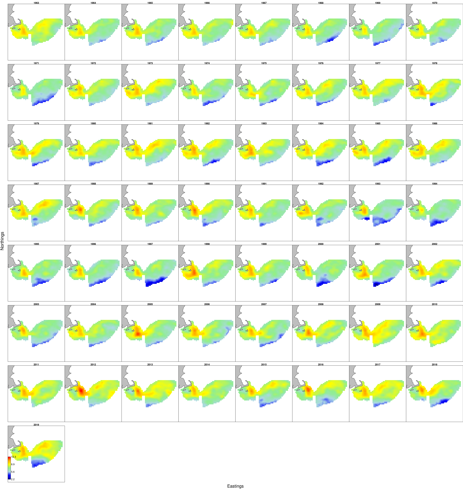

---
title:
geometry: left=2cm, right=2cm, top=2cm, bottom=3cm, footskip = .5cm
output: 
  pdf_document:
    includes:
      in_header: latex/header.tex
    keep_tex: yes
bibliography: SOE2020.bib
csl: plos.csl
link-citations: yes
fontsize: 10pt
subparagraph: yes
---

```{r setup, include=FALSE}
#Default Rmd options
knitr::opts_chunk$set(echo = FALSE,
                      message = FALSE,
                      warning = FALSE,
                      fig.align = 'center') #allows for inserting R code into captions

library(tidyverse)
library(readxl)
library(kableExtra)

```

# Introduction

In the table below we summarize all comments and requests with sources. The Progress column briefly summarizes how we responded, with a more detailed response in the numbered Memo Section. In the Progress column, "SOE" indicates a change included in the report(s).

```{r summtable}
# take from google drive to automatically update any changes
#googledrive::drive_download("Northeast IEA/State of the Ecosystem Reports/SOE 2020/Workshop & Meeting Notes/Request checklist", path="2019requests.xlsx", overwrite = TRUE)

requests <- read_excel("2019requests.xlsx", sheet="MemoTable", range = 'A1:D32')

#requests$`Memo Section` <- paste0("[", requests$`Memo Section`, "](#",requests$`Memo Section`,")") #trying to make clickable links in the table to sections, not working
#adding format = "markdown" to kable statement made them links but they still didnt jump to report sections and messed up other formatting

knitr::kable(requests, longtable = T, booktabs = TRUE, linesep = "") %>%
  kable_styling(font_size=9, latex_options = c("hold_position", "striped", "repeat_header")) %>%
  row_spec(0,bold=TRUE) %>%
  column_spec(1, width="5cm") %>%
  column_spec(2, width="2cm") %>%
  column_spec(3, width="5cm") %>%
  column_spec(4, width="2cm")
```


# Responses to comments

## 1 

Both Councils asked for a summary "report card" similar to that used in Alaska [@zador_ecosystem_2016]. The first page of this year's SOE reports summarizes the key messages with icons showing the message theme (e.g., commercial fisheries, fishing communities, forage species, system productivity, etc). At present, we synthesized key findings on both existing and new indicators. We welcome suggestions for indicators that should always be tracked in this section, and for further refinements to make this summary more useful.

## 2 

Both Councils asked for a summary visualization. The first page of the SOE report uses icons developed to help visualize different report components. The second page of this year's SOE report has both a map visualizing the key oceanographic features mentioned in the report along with fishing communities, and a conceptual model visualizing potential linkages between report indicators. The conceptual model is discussed further under point [5](#5) below.

## 3

Both Councils asked for uncertainty estimates to be included with indicators. As a first step, we included survey design-based uncertainty estimates for all surveys where we had haul specific information (all but the inshore ME-NH survey). Including this uncertainty led to a different approach to the data, looking for true departures from expected stable dynamics at the functional group level, and provided insight into which trends were potentially noteworthy. Survey biomass uncertainty is included in each SOE (p. MAFMC and p. NEFMC).

We experimented with a model-based estimate of uncertainty for survey biomass which accounts for both spatial and temporal sources (VAST; @thorson_guidance_2019). The results are promising (Fig. \ref{fig:VASTtest}). This method can also potentailly combine the inshore and offshore surveys into a single analysis. If the SSCs and Councils consider this approach promising, we will persue it further for next year. 

```{r VASTtest, fig.cap="Georges Bank piscivoves biomass and uncertainty as estimated by the VAST model.", fig.show='hold', out.width='49%'}


knitr::include_graphics("images/biomass_plot.pdf")

```

Some indicators (e.g. total landings) may have uncertainty which is difficult to calculate (e.g. based on unknown reporting errors). Many other current indicators do not have straightforward uncertainty calculaltions (e.g. diversity indices, anomalies) so we welcome suggestions from the SSC and Council to guide estimation for future reports.

## 4

The NE SSC asked to include downeast ME in future reports, because the Scotian Shelf EPU which includes downeast ME has not been included in previous reports. We felt it was inappropriate to report on the Scotian Shelf EPU, which includes Canadian waters and is an incomplete portion of the full Soctian Shelf. However, this year we recalculated survey biomass using an updated strata set that includes much of downeast ME (p. MAFMC and p. NEFMC and see updated methods^[https://noaa-edab.github.io/tech-doc/survdat.html]). Further, fishery catch and revenue data, fishing community data, and recreational indicators have always included downeast ME because both fishing statistical areas and human community data include all of ME. Therefore, fishery and fish biomass information reflects much of the area. 

Oceanographic indicators (surface and bottom temperature, phytoplankton, zooplankton) remain at the EPU level. The EPUs were defined based on these characteristics^[https://noaa-edab.github.io/tech-doc/epu.html] so we are hesitant to alter them for these indicators without a more thorough examination of the EPU definitions in general. 

## 5

Both Councils have been interested in ecosystem energy flow and how changes in ecosystem productivty link to fishery production. In particular, the NE SSC asked about further links between zooplankton abundance and or community composition to fish condition. Research was initiated during 2019 evaluating statistical relationships between environmental indicators including temperature, depth, and zooplankton community composition and fish condition. Initial results are noted in each SOE (p. MAFMC and p. NEFMC). Further work is ongoing to link more of the indicators in the report using both statistical analysis and potentially structural equation modeling as noted on p. 2 of each SOE under "Research Spotlight."

## 6

Both Councils asked for information on ocean acidification (OA). 

## 7

Gulf Stream Index/Labrador current interaction

## 8

Include source for PP estimates (satellite vs in situ)

## 9

Shellfish growth/distribution linked to climate (system productivity)

## 10

Esturine condition relative to power plants and temp

## 11

Frequency and occurance of warm rings

## 12

Cold pool index

## 13

Nutrient inputs and water quality near shore

## 14

Link environmental and social, economic indicators

## 15

Quantitative overlap of wind area and habitat and fishing areas

## 16

Include links to Social Science websites

## 17

Management complexity

## 18

South atlantic managed species represented in recreational indices - break out species managed by MA, SA and AS.

## 19

Add social elements from overview conceptual model to NE conceptual model

## 20

Avg weight of diet components by feeding group

## 21

North Atlantic Right Whale calf production indicator

## 22

Distinguish managed species in report

## 23

Marine Mammal consumption

## 24

Small pelagic abundance

## 25

Young of Year index from multiple surveys

## 26

Biomass of sharks

## 27

Diversity metric for NEFSC trawl survey

## 28

Mean stomach weight across feeding guilds

## 29

Ecosystem risk score

## 30

Inflection points for indicators

# References

