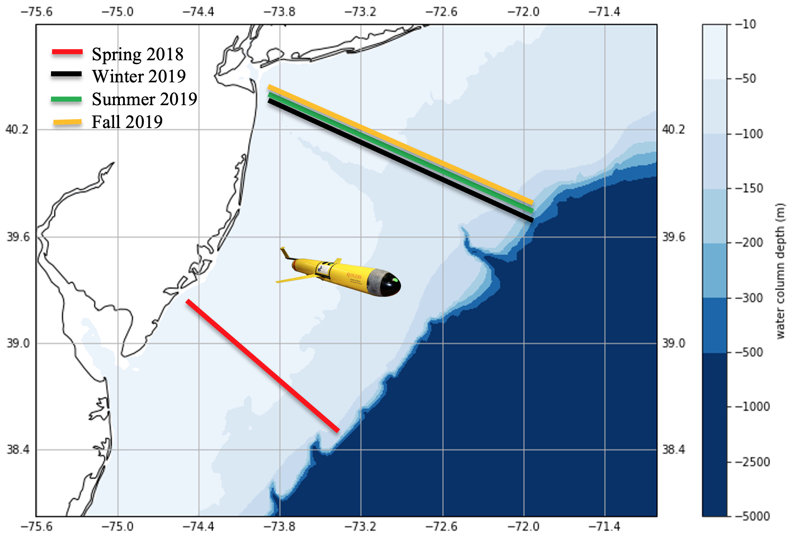
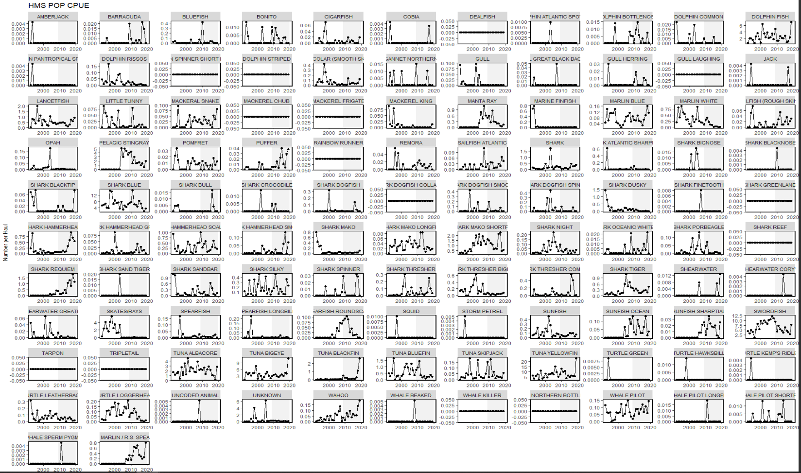
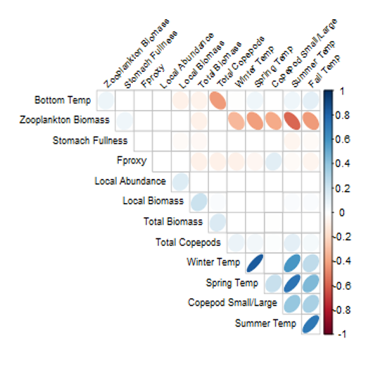

---
title:
geometry: left=2cm, right=2cm, top=2cm, bottom=3cm, footskip = .5cm
output: 
  pdf_document:
    includes:
      in_header: latex/header2021.tex
    keep_tex: yes
bibliography: SOE2021.bib
csl: plos.csl
link-citations: yes
fontsize: 10pt
subparagraph: yes
urlcolor: blue
---

```{r setup, include=FALSE}
#Default Rmd options
knitr::opts_chunk$set(echo = FALSE,
                      message = FALSE,
                      warning = FALSE,
                      fig.width = 4,
                      fig.asp = 0.45,
                      dev = "cairo_pdf",
                      fig.align = 'center') #allows for inserting R code into captions

library(tidyverse)
library(readxl)
library(kableExtra)
library(ecodata)
library(googledrive)
library(pacman)
p_load(repmis, RCurl, DT, magrittr, gsubfn, stringr, tidyverse)


```

```{r, include = F}
#this is to wrap text around figures if we want
defOut <- knitr::knit_hooks$get("plot")  # save the default plot hook 
knitr::knit_hooks$set(plot = function(x, options) {  # set new plot hook ...
  x <- defOut(x, options)  # first apply the default hook
  if(!is.null(options$wrapfigure)) {  # then, if option wrapfigure is given ...
    # create the new opening string for the wrapfigure environment ...
    wf <- sprintf("\\begin{wrapfigure}{%s}{%g\\textwidth}", options$wrapfigure[[1]], options$wrapfigure[[2]])
    x  <- gsub("\\begin{figure}", wf, x, fixed = T)  # and replace the default one with it.
    x  <- gsub("{figure}", "{wrapfigure}", x, fixed = T)  # also replace the environment ending
  }
  return(x)
})
```

<!--
NOTES

Use the code=readLines with the setup chunks from ecodata: need to do before each set of figs from a region/subgroup

-->

```{r, message=FALSE, results='hide'}
#results link https://docs.google.com/spreadsheets/d/1BSsibzyrj-ge3n55BunQBgNPbcL_gy3BzwGmosnV2vY/edit#gid=0

resultfile <- drive_find(pattern = "SOE_Request_Checklist", type = "spreadsheet")

requests <- drive_download(resultfile, type = "csv", overwrite = TRUE) %>%
  {read.csv(.$local_path)} 

```

# Introduction

In the table below we summarize all comments and requests with sources. The Progress column briefly summarizes how we responded, with a more detailed response in the numbered Memo Section. In the Progress column, "SOE" indicates a change included in the report(s).

```{r summtable}
# take from google drive to automatically update any changes
#googledrive::drive_download("Northeast IEA/State of the Ecosystem Reports/SOE 2020/Workshop & Meeting Notes/Request checklist", path="2019requests.xlsx", overwrite = TRUE)

#requests <- read_excel("2019requests.xlsx", sheet="MemoTable", range = 'A1:D31')

#requests$`Memo Section` <- paste0("[", requests$`Memo Section`, "](#",requests$`Memo Section`,")") #trying to make clickable links in the table to sections, not working
#adding format = "markdown" to kable statement made them links but they still didnt jump to report sections and messed up other formatting

requeststab <- requests %>%
  select(Request, Year, Source, Progress) %>%
  mutate("Memo Section" = rownames(.))

knitr::kable(requeststab, longtable = T, booktabs = TRUE, linesep = "") %>%
  kable_styling(font_size=9, latex_options = c("hold_position", "striped", "repeat_header")) %>%
  row_spec(0,bold=TRUE) %>%
  column_spec(1, width="5cm") %>%
  column_spec(2, width="1cm") %>%
  column_spec(3, width="2cm") %>%
  column_spec(4, width="5cm") %>%
  column_spec(5, width="2cm")
```

# Responses to comments

<!-- compiled this to md then copied back in, filled in text between
```{r, results='asis'}
for(i in 1:nrow(requeststab)) {
  cat("##", requeststab$'Memo Section'[i], as.character(requeststab$Request[i]), "\n")
  cat("\n")
}
```
-->

1 Report card and summary visualizations
----------------------------------------

Both Councils requested a "report card" style summary section with visualizations in 2019. We introduced a 2 page summary format in 2020 with a bulleted list of results on the first page and visualizations on the second. This year, the report was reorganized to more clearly link indicators with fishery management objectives and to better synthesize results across indicators, so the summary section was restructured accordingly. The 2021 summary pages include: 

1. a report card style table summarizing status and trends of indicators linked to management objectives, combined with brief descriptions of implications for management synthesizing across multiple indicators in the report;  
2. a bulleted list highlighting risks to meeting fishery management objectives, including those from climate change and those from wind energy development; and  
3. visualizations of ecosystem synthesis themes integrated in the report, including multiple drivers of change, regime shifts, and ecosystem reorganization.  

We welcome feedback on these revisions and suggestions for further refinements to make this summary more useful. 

2 Ecosystem Overfishing indicators (Link and Watson, 2019)
----------------------------------------------------------

Both Councils have requested more information on ecosystem thresholds and inflection points. This year we have calculated two ecosystem overfishing indicators with proposed thresholds [@link_global_2019] for each ecological production unit (EPU) on the northeast US shelf. We note the caveats with this analysis and request feedback on how the Councils would like to move forward with these indicators in the future:

1. The proposed ecosystem overfishing thresholds are calculated based on *total catch* while our preliminary indicators are based on *commercial landings*. Therefore, our current indicators are underestimated compared with the proposed thresholds. It is possible to add commercial discards and recreational landings and dead discards in the future, or to calculate how much additional catch is required to exceed a threshold.

2. The proposed ecosystem overfishing thresholds are based on a global analysis. The indices define ecosystem productivity in different ways. The Ryther Index is effectively based on fishery removals relative to global primary productivity per unit area, while the Fogarty Index is based on fishery removals relative to regional primary productivity [@link_global_2019]. The study authors "recommend that the indices proposed here be used cognizant of other potential sources of productivity and that are relevant to the scale at which fisheries management mostly occurs."

Our implementation of these indicators is fully documented in an R package [`eofindices`](https://noaa-edab.github.io/eofindices/index.html), where a disucssion of technical details including the [2021 calculations](https://noaa-edab.github.io/eofindices/articles/workedExample2021.html) and potential [future work](https://noaa-edab.github.io/eofindices/articles/futureWork.html) are also provided. We welcome suggestions for further analysis that would be most useful for the Councils to evaluate and potentially use these ecosystem overfishing indices. 

3 Primary production required, interpretation of decline?
---------------------------------------------------------

Both Councils were interested in further interpretation of the decline in the fraction of primary production required to support commercial landings presented in the 2020 reports. For 2021, this indicator was extended back in time by reconstructing total primary production prior to the satellite era using the mean of 1998-2010 as values for pre 1998 (Fig. \ref{fig:pp-recon}). This gives a fuller context of the demand that much higher historical landings placed on ecosystem productivity relative to current landings.
```{r, code = readLines("https://raw.githubusercontent.com/NOAA-EDAB/ecodata/master/chunk-scripts/human_dimensions_MAB.Rmd-setup.R")}
```

```{r, code = readLines("https://raw.githubusercontent.com/NOAA-EDAB/ecodata/master/chunk-scripts/human_dimensions_MAB.Rmd-GIS-setup.R")}
```

```{r pp-recon, fig.cap="Primary production reconstructed (dashed line) using the mean of satellite-derived values from 1998-2010 (points); example for the Mid-Atlantic Bight.", code = readLines("https://raw.githubusercontent.com/NOAA-EDAB/ecodata/master/chunk-scripts/human_dimensions_MAB.Rmd-pp-reconstructed.R")}
```

It is also interpreted in the context of the ecosystem overfishing indicators introduced this year, which suggest when ecosystem overfishing may have ocurred over the past 50 years. In the SOE, we note that fisheries catches are sustained by a lower proportion of the ecosystem's primary production now than in the past, particularly when compared with the 1970s when the Fogarty and Ryther indices suggest that ecosystem overfishing may have occurred in the MAB and on GB. We also note that landings are generally declining while primary production remains steady or increasing across the EPUs. A full set of plots to help interpret the primary production required and ecosystem overfishing indices (including mean trophic level, which species are included in the landings, and the primary production time series) are available [online](https://noaa-edab.github.io/eofindices/articles/currentIndices.html). We welcome suggestions to include additional plots or conduct analyses to improve interpretation of these indices for the Councils. 

4 Climate Change context
------------------------

The NE SSC was interested in more explicitly addressing climate change in the reports. As described above, we have now reorganized the report into two major sections. The second section outlines risk to meeting fishery management objectives, with climate change representing the first major risk category (the other is offshore wind energy development). Climate risks to meeting fishery management objectives are also explicitly indicated and cross-referenced in the first section on performance against management objectives. We welcome feedback on this structural revision.

Climate forecasts at scales relevant to fishery management (months to years) are in progress, with at least one paper on statistical bottom temperature forecasts in review at present. We plan to include more of this information in future reports as the science becomes available, and welcome guidance on which forecast variables might be most useful to the Councils.

5 Clarify language (e.g., primary production required)
------------------------------------------------------

Both Councils asked for clarification of several terms, including "primary production required," and "fishery engagement." The NE SSC suggested adding a glossary to improve clarity. We have added an online glossary (https://noaa-edab.github.io/tech-doc/glossary.html) which is linked from the report to explain many terms. The Northeast Fisheries Science Center Research Communications Branch (NEFSC RCB) also reviewed the draft document to streamline language, and brief text was added to explain the information used in each indicator.

6 Copy Editing
--------------

The NE SSC pointed out copy editing errors in the document. The NEFSC RCB copy edited a draft version of the 2021 document. We are working to further integrate RCB copy editing into our production process in the future.

7 Ocean Acidification
---------------------

Last year we reported on work in progress related to Ocean Acidification (OA), including:

  * Aleck Wang (WHOI) and Chris Melrose (NEFSC) are working on climatology of spatial and seasonal patterns of carbonate chemistry parameters on the Northeast U.S. Continental Shelf, which will form a critical baseline for future OA indicators.
  * Grace Saba (Rutgers) is the lead PI on a new project which is using gliders to characterize OA conditions and to validate/improve OA models for the region.
  * There is ongoing experimental work being conducted at the NEFSC Milford lab that we could include if the information is relevant

Both Councils, and in particular the NE SSC, were interested in including this work as it becomes available. This year we included the data from gliders characterizing seasonal OA conditions on the Mid-Atlantic shelf (p. MAFMC and Fig. \ref{fig:glidertracks}), and compared the observed OA conditions with preliminary lab results on pH thresholds where surfclam growth may be impacted (p. MAFMC).

```{r glidertracks, fig.cap="Locations and timing of glider-based pH transects on the Mid-Atlantic shelf.", out.width='70%'}

```

We will continue to update OA information as it becomes available. 

8 Include examples of High/Low engaged ports
--------------------------------------------

Both Councils were interested in more information on fishery engagement trends, including clearer definitions of engagement and reliance, and the NE SSC requested examples of engagement scores at the fishing community level. Fishery engagement, reliance, and social vulnerability are briefly defined in the SOE text and glossary, with a link to the NMFS webpage defining all of these indicators and a maps with information for all communities. 

A new presentation of individual community status with respect to engagement, reliance, and social vulnerability for both commercial and recreational fisheries was included as a baseline (p. MAFMC and p. NEFMC), to be updated in future years so that Councils may keep track of changes in community status.

9 Expand wind lease area and habitat overlap
--------------------------------------------

The Mid-Atlantic Council and SSC remain interested in the potential effects of offshore wind development on ecosystems and fishery management, and asked to see expanded consideration of information beyond the NEFSC bottom trawl survey. This year offshore wind development indicators are highlighted in the new SOE section on risks to meeting fishery management objectives. The MA SSC expressed interest in an indicator of fishery revenue within wind lease areas, which has been provided this year with a focus on Council-managed species in each SOE report (p. MAFMC and p. NEFMC). Information on overlap of scientific surveys for ocean physics, low trophic levels, shellfish, fish, and protected species with wind lease areas is also provided in each report (p. MAFMC and p. NEFMC). Detailed maps highlighting the timing and type of potentail development are also included. The wind energy area and habitat overlap information presented in 2020 could not be updated as there were no new NEFSC bottom trawl surveys, but the table is retained online as supplementary informtion. 

During the production process, new information summarizing seabird, cetatean, and turtle "hotspots" with respect to wind lease areas was submitted by Timothy White (BOEM). We present that information here for feedback to determine if this should be refined and included in future SOE reports. Hotspot richness was defined as the sum of the number of persistent hotspots across taxa. Tim calculated individual persistent hotspots for about 60 different species (whales, seabirds, and sea turtles), then summed the individual hotspots across each grid cell to calculate hotspot richness, as shown on the map. A cell with a hotspot richness value of 8 represents 8 species-specific hotspots. All the wind energy areas intersect hotspots, and all values greater than 1 represent multi-species persistent hotspots (Fig. \ref{fig:hotspots}). Visualizations of hotspots for cetaceans, seabirds, and turtles separately are available [online]().

```{r hotspots, fig.cap="Overlap of whale, seabird, and turtle hotspots with wind lease areas."}
knitr::include_graphics("images/cetaceans_seabirds_turtles_hotspot_richness_v2-1.pdf")
```

We welcome further discussion on the expanded offshore wind development section, and suggestions for further indicator development that is most beneficial to the Councils.

10 Expand cold pool index
-------------------------

The MA SSC was interested in an expanded cold pool index, in particular with respect to timing of stratification and its breakdown in the fall. This year we introduced new cold pool metrics based on the [GLORYS12V1 dataset](https://resources.marine.copernicus.eu/?option=com_csw&task=results?option=com_csw&view=details&product_id=GLOBAL_REANALYSIS_PHY_001_030), which is an global ocean reanalysis model for the ocean physics with 8 km resolution and 50 depth layers. In prior years, bottom temperature observations from the surveys were used to define the cold pool index. The advantage of the modeled product is the improved spatial and temporal resolution compared to the survey data.  The vertical layers of the model will also allow us to examine stratification and mixing indices in future reports.  One limitation, however, is the time series is shorter and there is a lag in the availability of the more recent data; current availaility is January 1993-June 2019. 

In the SOE we visualize changes in cold pool area using this dataset to allow the Council to see how this dynamic habitat varies annually and in response to the temperature indicators we report. While we considered this to be an intuitive initial presentation, there are many other possible cold pool metrics that could be reported from this dataset. For example, time series of four additional metrics are available in the SOE dataset, [`ecodata`](https://github.com/NOAA-EDAB/ecodata) (Fig. \ref{fig:coldpool}): 

1. Name: T_mean; Definition: yearly-mean cold pool temperature distribution; Units: degrees C.  
2. Name: T_min; Definition: yearly-min cold pool temperature distribution; Units: degrees C.  
3. Name: T_peak; Definition: spatial cold pool temperature distribution at the peak day 140; Units: degrees C.  
4. Name: V_max; Definition: yearly-max cold pool vertical distribution relative to depth; Units: meter/meter.  
```{r, code = readLines("https://raw.githubusercontent.com/NOAA-EDAB/ecodata/master/chunk-scripts/LTL_MAB.Rmd-setup.R")}
```

```{r coldpool, fig.cap="Mid-Atlantic cold pool metrics from the GLORYS reanalysis dataset, as defined in text above.", fig.width=7, code = readLines("https://raw.githubusercontent.com/NOAA-EDAB/ecodata/master/chunk-scripts/LTL_MAB.Rmd-cold_pool.R")}
```

We welcome feedback on whether using this reanalysis dataset is preferable to the prior observation-based cold pool index. Dynamics of the cold pool have been described in detail using model-based information [@chen_seasonal_2018]. If this dataset seems promising, we seek suggestions on metrics the SSC would like to see from this dataset and how to present this information so that it is most useful to the Council. 

11 Seperate Bigelow/Albatross catch diversity metric
----------------------------------------------------

The NE SSC requested a species diversity metric based on NEFSC trawl survey data. We had included such a metric in past reports (2017), but were concerned that apparent differences in diversity prior to and after 2008 may be driven by differences in survey vessels. While species-specific cpue and sizes have calibration coefficents between survey vessels, the number of species captured by the vessels has no known calibration coefficient.

After discussion with both SSCs in 2020, we calculated NEFSC trawl survey diversity metrics separately for the Albatross and Bigelow survey vessel time series. In each 2021 SOE we report the expected number of species per 1000 individuals sampled for each EPU in the fall, with uncertainty  (p.  MAFMC and p.  NEFMC). Distinguising potential vessel effects from trends in diversity should be facilitated by this presentation. Plots for spring, as well as comparisons with Shannon diversity metrics combining both vessel time series as originally calculated, are available online (https://noaa-edab.github.io/ecodata/macrofauna_NE#Survey_Shannon_Diversity, https://noaa-edab.github.io/ecodata/macrofauna_MAB#Survey_Shannon_Diversity). We welcome further discussion to refine this and other diversity indices.

12 Shark abundance and catch indicators
---------------------------------------

The MAFMC requested information on biomass of sharks, as fishermen had reported encountering more blacktip, spinner, and sandbar sharks each summer. Both Councils have been interested in expanding data sources beyond the NEFSC bottom trawl survey for improved understanding of ecosystem dynammics. We were able to obtain commercial landings (Fig. \ref{fig:hmsland}), recreational landings (SOE p. MAFMC and p. NEFMC), and CPUE data (SOE p. MAFMC and p. NEFMC) from the Highly Migratory Species (HMS) group at NMFS Headquarters as well as bycatch information from the NEFSC Observer Program (SOE p. MAFMC and p. NEFMC). 
```{r hmsland, fig.asp=1, fig.cap="Highly Migratory Species (HMS) landings; groups include “Bluefin Tuna”, “BAYS”, “Swordfish”, “Large Coastal Sharks”, “Small Coastal Sharks”, “Pelagic Sharks”, “Smoothhound Sharks”. “BAYS” includes bigeye, albacore, yellowfin and skipjack tunas. “Large Coastal Sharks” includes blacktip, bull, great hammerhead, scalloped hammerhead, smooth hammerhead, lemon, nurse, sandbar, silky, spinner, and tiger sharks. “Small Coastal Sharks” includes Atlantic sharpnose, blacknose, bonnethead, finetooth sharks. “Pelagic Sharks” includes blue, porbeagle, shortfin mako, and thresher sharks. “Smoothhound Sharks” includes smooth dogfish shark.", code = readLines("https://raw.githubusercontent.com/NOAA-EDAB/ecodata/master/chunk-scripts/human_dimensions_MAB.Rmd-hms-landings-comdat-commercial_landings.R")}

```
In addition, commercial revenue from HMS (Fig. \ref{fig:hmsrev}) and information on CPUE (bycatch) of many other species (Table \ref{tab:hmsbycatch}) is available. 
```{r hmsrev, fig.asp=1, fig.cap="HMS revenue, groups are the same as previous figure.", code = readLines("https://raw.githubusercontent.com/NOAA-EDAB/ecodata/master/chunk-scripts/human_dimensions_MAB.Rmd-hms-comm-revenue.R")}

```

```{r hmsbycatch}
#fig can't be made big enough to read, trying a table
#fig.cap="Example species CPUE available from HMS fishery observations.", out.width='70%'
#

# knitr::kable(sort(unique(ecodata::hms_cpue$Var)),
#              col.names = "Species",
#              caption = "Species with CPUE available from HMS fishery observations.") 
# 

spplist <- ecodata::hms_cpue %>%
  filter(Value>0) 

Species <- as.matrix(sort(unique(spplist$Var)))

rows <- seq_len(nrow(Species) %/% 2)
knitr::kable(list(Species[rows,1],  
           matrix(numeric(), nrow=0, ncol=1),
           Species[-rows, 1]), 
          col.names = "Species", 
      caption = "Species with CPUE available from HMS fishery observations.",
      label = "hmsbycatch", format = "latex", booktabs = TRUE) 

  
```

With these new contributions, we can potentially include more information on performance relative to management objectives for HMS, such as a Kobe plot similar to the one presented for Council-managed species. We welcome feedback on what additional information on HMS would be most useful to the Councils in future SOE reports.

13 Uncertainty estimates
------------------------

Both Councils asked for uncertainty estimates to be included with indicators. Uncertainty estimates are now included for all survey biomass indices (see also [Section 23](#vast-and-uncertainty)), survey diversity (expected number of species), harbor porpoise and gray seal bycatch, North Atlantic right whale abundance, forage anomaly, and forage fish energy density indicators. We continue to work towards including uncertainty estiamtes for as many indicators as possible. We welcome feedback from the Councils on which indicators are highest priority for the estimation and visualization of uncertainty. 

14 Bycatch index
----------------

The NEFMC was interested in additional bycatch indices. This year we added an index of gray seal bycatch to both SOE reports (p. MAFMC and p. NEFMC). We have also added observer information on bycatch of sharks in Northeast US fisheries and additional information is available on catch and bycatch of multiple species in pelagic fisheries (see [Section 12](#shark-abundance-and-catch-indicators)). We welcome suggestions for which species bycatch indices to prioritize in future reports. 

15 Marine Mammal consumption
----------------------------

The MAFMC has continued interest in estimates of marine mammal consumption. While there have been no updated reports of total marine mammal consumption for the US Northeast Shelf ecosystem since 2015 @smith_consumption_2015, new diet studies are in progress. We included updated information on seal diets in both SOE reports (p. MAFMC and NEFMC). Once completed, these diet studies combined with mammal population estimates (see [Section 24](#seal-index)) could be used to update marine mammal consumption estimates.

16 Estuarine Water Quality
--------------------------

Both Councils have been interested in estuarine water quality. While the Chesapeake Bay water quality index reported previously is updated on a 3-year basis, so no update was available this year, we included more information on Chesapeake Bay conditions and impacts to managed species in the MAFMC SOE. The NE SSC was interested in estuarine water quality in the New England region; and we have been in discussion with multiple organizations working in coastal and estuarine systems to incorporate more information. However we had inadequate resources develop New England estuarine water quality indicators in 2020. 

17 Linking Condition
--------------------

Both Councils were interested in more quantitative analysis linking environmental indicators, managed fish indicators, and fishery indicators to facilitate use of this information in management. Considerable progress has been made on linking environmental indicators to fish condition for multiple species, with an overview of preliminary Generalized Additive Modeling (GAM) results described in the SOE. The NE SSC commented that overall (total) biomass could be included in the analysis of fish condition; this has been included in the analysis, as well as local abundance and local biomass (Fig. \ref{fig:cond-drivers}). 

```{r cond-drivers, fig.cap="Preliminary results: GAM fish condition deviance explained by environmental variables, with darker cells indicating more important variables for that species.", out.width='60%'}
#knitr::include_url("https://github.com/NOAA-EDAB/ecodata/raw/master/docs/images/condition_proj.png")
knitr::include_graphics("images/Condition_table.png")
```
Correlations between the potential drivers of condition are also being explored. Indices that are correlated (R>0.3, dark cells in Fig. \ref{fig:cond-corr}) will not be used together in future full GAM analyses.  
```{r cond-corr, fig.cap="Preliminary results: correlations between potential environmental drivers of fish condition.", out.width='60%'}
#knitr::include_url("https://github.com/NOAA-EDAB/ecodata/raw/master/docs/images/condition_proj.png")

```

The MA SSC commented that indices of growth (weight at age) used in stock assessments could also be included in the analysis, and that methods such as Gaussian network modeling may be appropriate. The fish condition working group explored GAM analyses to link environmental indices to weights at age for managed fish species, but there were diagnostic issues that were not present in the condition analyses. The fish condition working group is continuing to make improvements to the GAM analyses, exploring options for indices of growth to integrate this information into future analyses. Similarly, modeling approaches in addition to GAMs are under investigation. Another component of the project evaluating potential links between fish condition and market prices is also ongoing.  

18 Avg weight of diet components by feeding group
-------------------------------------------------

This information is being examined as part of the fish condition links project described above. However, we had insufficient resources to develop an independent indicator for the SOE in 2020. 

19 Mean stomach weight across feeding guilds
--------------------------------------------

This information is being examined as part of the fish condition links project described above. However, we had insufficient resources to develop an independent indicator for the SOE in 2020. 

20 Shellfish growth/distribution linked to climate (system productivity)
------------------------------------------------------------------------

The MAFMC requested that we investigate how shellfish growth and distribution information could be linked to climate indicators and possibly ecosystem productivity. We are working with Dr. Roger Mann who has obtained NSF INTERN funding for his student Alexis Hollander to spend up to 6 months at NEFSC working on shellfish growth, and to facilitate integration of SOE climate indicators with this work. This work should proceed later in 2021 or whenever in-person work is feasible.

21 Cumulative weather index
---------------------------

The MAFMC requested that we include information on weather that might affect recreational or commercial fishing effort. We are partnering with the National Weather Service (NWS) to provide this type of information. A preliminary index was developed based on Small craft/Gale warnings from the NWS Boston forecast office for the area off Cape Cod (Table \ref{tab:weather}). 

```{r weather}

weather <- data.frame("Year" = c(2008:2019),
                      "Gale Warnings" = c(61, 49, 47, 48, 30, 43, 36, 80, 55, 52, 60, 57),
                      "Storm Warnings" = c(8,11,6,5,8,6,7,3,8,15,14,8))
# Copied from LTL notes https://docs.google.com/document/d/1KDgTxT0X4L14b5tfV_jMXyOFtUjvv76u4QVr1OMi_Yc/edit#
# 2019: 57 Gale and 8 Storm Warnings
# 2018: 60 Gale and 14 Storm Warnings
# 2017: 52 Gale and 15 Storm Warnings
# 2016: 55 Gale and 8 Storm Warnings
# 2015: 80 Gale and 3 Storm Warnings
# 2014: 36 Gale and 7 Storm Warnings
# 2013: 43 Gale and 6 Storm Warnings
# 2012: 30 Gale and 8 Storm Warnings
# 2011: 48 Gale and 5 Storm Warnings
# 2010: 47 Gale and 6 Storm Warnings
# 2009: 49 Gale and 11 Storm Warnings
# 2008: 61 Gale and 8 Storm Warnings


knitr::kable(weather, 
             caption = "Gales = winds >=34 knots (usually associated with a coastal storm); 
Storm = winds >=48 knots (the *big ones*)",
label = "weather", format = "latex", booktabs = TRUE)


```

We seek feedback from the Council on the utility of this information to further develop an indicator for future SOE reports. Is monthly data more useful than annual as above? Would seasonal aggregates be useful? Is there a certain wind speed where vessels alter effort? We look forward to further integration of NWS information for our region.

22 Management complexity
------------------------

The MAFMC asked for indicators of management complexity for use in the EAFM risk assessment. An NEFSC summer student started work on this in 2018, but we have lacked capacity to finish the project since then. If resources allow we will continue the project, and guidance for further indicator developmet is welcome.

23 VAST and uncertainty
-----------------------

Both Councils were interested in model-based estimates of aggregate fish biomass and uncertainty based on preliminary results presented in 2020. We experimented with a model-based estimate of uncertainty for survey biomass which accounts for both spatial and temporal sources (VAST; @thorson_guidance_2019). Although the surveys were not completed this year, work on model-based estimates continues and may be presented next year.

24 Seal index
-------------

The MA SSC requested indices of abundance for seals rather than the narrative supplied in 2020. Analysis and review is in progress to update abundance and possibly assess trends in US waters for harbor and gray seals; however, these estimates were not available for the 2021 SOE. New information on increasing numbers of gray seal pups born at US pupping sites has been added to the narrative for both SOE reports. A plot visualizing pup rates of increase has been added to the NEFMC SOE, as it is most relevant to the Gulf of Maine.

A detailed stock assessment for Canadian Northwest Atlantic gray seals was published in 2017 and is available [online](https://waves-vagues.dfo-mpo.gc.ca/Library/40646749.pdf). As noted in the SOE, the Candian population is likely supplementing the US population, and seals range widely, so distinguishing trends within US waters or individual EPUs is complex. However, a gray seal survey is in progress for 2021, and updated information will be included as it is available.

25 Incorporate social sciences survey from council
--------------------------------------------------

The NE SSC was interested in reviewing information on the perception and use of social science information from an NEFMC survey. We had insufficient resources to address this in 2020.  We welcome input from the New England Council and staff on how best to incorporate this information in future reports.

26 Young of Year index from multiple surveys
--------------------------------------------

The MA SSC was interested in a young of year index from multiple surveys. In past reports we have included the fish productivity index, which calculates the number of small fish per biomass of large fish of the same species from NEFSC surveys. This index is based only on the NEFSC bottom trawl survey, which was not completed in 2020, so the index was not updated; we retain last year's indices online for reference ( [MAB](https://noaa-edab.github.io/ecodata/macrofauna_MAB#Productivity_anomaly), [GB and GOM](https://noaa-edab.github.io/ecodata/macrofauna_NE#Productivity_anomaly)). We recognize that this is not strictly a young of year index, and it is from a single survey. 

We had insufficient resources to address this in 2020.  

27 Biomass of species not included in bottom trawl surveys
----------------------------------------------------------

We included information on sharks this year ([Section 12](#shark-abundance-and-catch-indicators)), and data streams for many other species not captured by bottom trawl surveys (BTS) are under investigation. However, we had insufficient resources to address this fully in 2020.  

28 Estuarine condition relative to power plants and temp
--------------------------------------------------------

We had insufficient resources to address this in 2020.  

29 Inflection points for indicators
-----------------------------------

While this could not be addressed for individual indicators in 2020, we did include new Ecosystem Overfishing indicators with proposed thresholds (see Section 2, [Ecosystem Overfishing indicators](#ecosystem-overfishing-indicators-link-and-watson-2019)). We welcome suggestions for which additional indicators or groups of indicators should be prioritized for inflection point/threshold analysis in upcoming years.  

30 Reduce indicator dimensionality with multivariate statistics
---------------------------------------------------------------

The NE SSC suggested statistical analysis to reduce the number of indicators and remove redundant indicators in the report. Some work has been initiated on this in past years, but we had insufficient resources to complete this in 2020.  

31 Breakpoints
--------------

While this could not be addressed for individual indicators in 2020, our newly introduced regime shifts synthesis theme will be explored further in upcoming years. We welcome suggestions for which individual indicators or groups of indicators should be prioritized for regime shift analysis in upcoming years.  

32 Re-evaluate EPUs
-------------------

Initial planning for re-evaluating Northeast US Shelf ecological production units has started, but we had insufficient resources to begin the project in 2020.  

# References

