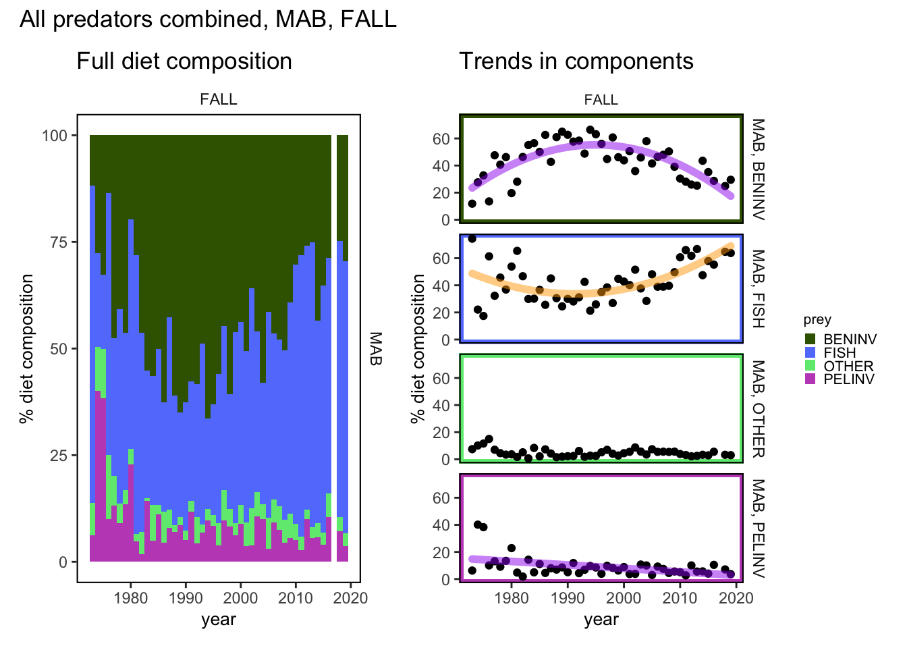

---
title:
geometry: left=2cm, right=2cm, top=2cm, bottom=3cm, footskip = .5cm
output: 
  pdf_document:
    includes:
      in_header: latex/header1.tex
    keep_tex: yes
bibliography: SOE2021.bib
csl: plos.csl
link-citations: yes
fontsize: 10pt
subparagraph: yes
urlcolor: blue
---

```{r setup, include=FALSE}
#Default Rmd options
knitr::opts_chunk$set(echo = FALSE,
                      message = FALSE,
                      warning = FALSE,
                      dev = "cairo_pdf",
                      fig.align = 'center') #allows for inserting R code into captions

library(tidyverse)
library(readxl)
library(kableExtra)
library(ecodata)
library(googledrive)
library(pacman)
p_load(repmis, RCurl, DT, magrittr, gsubfn, stringr, tidyverse)


```

```{r, include = F}
#this is to wrap text around figures if we want
defOut <- knitr::knit_hooks$get("plot")  # save the default plot hook 
knitr::knit_hooks$set(plot = function(x, options) {  # set new plot hook ...
  x <- defOut(x, options)  # first apply the default hook
  if(!is.null(options$wrapfigure)) {  # then, if option wrapfigure is given ...
    # create the new opening string for the wrapfigure environment ...
    wf <- sprintf("\\begin{wrapfigure}{%s}{%g\\textwidth}", options$wrapfigure[[1]], options$wrapfigure[[2]])
    x  <- gsub("\\begin{figure}", wf, x, fixed = T)  # and replace the default one with it.
    x  <- gsub("{figure}", "{wrapfigure}", x, fixed = T)  # also replace the environment ending
  }
  return(x)
})
```

<!--
NOTES

Use the code=readLines with the setup chunks from ecodata: need to do before each set of figs from a region/subgroup
-->

```{r, results='hide'}
  resultfile <- googledrive::drive_find(pattern = "SOE 2021 Response Checklist", type = "spreadsheet")
 # 
  requests <- googledrive::drive_download(resultfile, type = "csv", overwrite = TRUE) %>%
    {read.csv(.$local_path)} 

#requests <- read.csv(here("SOE 2021 Response Checklist.csv"))
```
# Introduction

In the table below we summarize all comments and requests with sources. The Progress column briefly summarizes how we responded, with a more detailed response in the numbered Memo Section. In the Progress column, "SOE" indicates a change included in the report(s).

```{r summtable}
# take from google drive to automatically update any changes
#googledrive::drive_download("Northeast IEA/State of the Ecosystem Reports/SOE 2020/Workshop & Meeting Notes/Request checklist", path="2019requests.xlsx", overwrite = TRUE)

#requests <- read_excel("2019requests.xlsx", sheet="MemoTable", range = 'A1:D31')

#requests$`Memo Section` <- paste0("[", requests$`Memo Section`, "](#",requests$`Memo Section`,")") #trying to make clickable links in the table to sections, not working
#adding format = "markdown" to kable statement made them links but they still didnt jump to report sections and messed up other formatting

requeststab <- requests %>%
  select(Request, Year, Source, Status, Progress) %>%
  mutate(Source = str_trim(str_extract(Source, "[^-]+"))) %>%
  arrange(match(Status, c("In SOE", 
                          "In SOE-MAFMC",
                          "In SOE-MAFMC, In progress-NEFMC",
                          "In progress", 
                          "Not started")), desc(Year)) %>%
  mutate("Memo Section" = rownames(.))

knitr::kable(requeststab, longtable = T, booktabs = TRUE, linesep = "") %>%
  kable_styling(font_size=9, latex_options = c("hold_position", "striped", "repeat_header")) %>%
  row_spec(0,bold=TRUE) %>%
  column_spec(1, width="4.5cm") %>%
  column_spec(2, width="1cm") %>%
  column_spec(3, width="2cm") %>%
  column_spec(4, width="1.5cm") %>%
  column_spec(5, width="4.5cm") %>%
  column_spec(6, width="1.5cm")
```


# Responses to comments

## 1 Add “This report is for [audience]”

The first sentence of each report now states the audience.

## 2 State management objectives first in report

The graphical summary on page 1 (MAFMC) and 1-2 (NEFMC) summarizes management objectives (columns in each table) and indicator performance relative to those objectives. Table 1 in the main body of each report (reproduced below) lists management objectives and indicators linked to those objectives. 

```{r management-objectives}

mng_obj <- data.frame("Objective Categories" = c("Seafood Production",
                                                 "Profits","Recreation",
                                                 "Stability","Social & Cultural",
                                                 "Protected Species",
                                                 "Biomass","Productivity",
                                                 "Trophic structure","Habitat"),
"Indicators reported" = c("Landings; commercial total and by feeding guild; recreational harvest",
                               "Revenue decomposed to price and volume",
                               "Angler trips; recreational fleet diversity",
                               "Diversity indices (fishery and ecosystem)",
                               "Community engagement/reliance and environmental justice status",
                               "Bycatch; population (adult and juvenile) numbers, mortalities",
                               "Biomass or abundance by feeding guild from surveys",
                               "Condition and recruitment of managed species, primary productivity",
                               "Relative biomass of feeding guilds, zooplankton",
                               "Estuarine and offshore habitat conditions"))

knitr::kable(mng_obj, linesep = "",
      col.names = c("Objective Categories","Indicators reported"),
      caption = "Ecosystem-scale fishery management objectives in the Mid-Atlantic Bight",
      #align = 'c',
      booktabs = T) %>%
  kable_styling(latex_options = "hold_position", "scale_down") %>%
 # column_spec(c(2), width = c("25em")) %>%
  row_spec(0, bold = TRUE) %>%
 # group_rows("Provisioning/Cultural", 1,4) %>%
 # group_rows("Supporting/Regulating", 5,9)
  pack_rows("Provisioning and Cultural Services", 1,6) %>%
  pack_rows("Supporting and Regulating Services", 7,10)


```


## 3 Ocean acidification (OA) in NEFMC SOE

Ocean acidification information was included in the MAFMC report in 2021, and was expanded to the Gulf of Maine and added to the NEFMC report in 2022. In both reports, OA information is presented in the Climate Risks section. Additional information is available in the Indicator catalog: https://noaa-edab.github.io/catalog/ocean-acidification-and-shellfish.html

## 4 Habitat impact of fishing based on gear

Both SOEs were revised this year to include a section on Habitat Risks. Both reports include a Fishing Gear Impacts subsection within the Habitat Risks section that links to detailed information on the outputs of the Northeast Fishing Effects Model. Detailed model results are available at the Northeast Ocean Data Portal (https://www.northeastoceandata.org/data-explorer/) under the Habitat/Fishing Effects - Seabed Habitat Disturbance and Fishing Effects - Intrinsic Seabed Habitat Vulnerablity. 

More details are available on the Indicator catalog page https://noaa-edab.github.io/catalog/northeast-fishing-effects-model.html

## 5 Revisit right whale language

The NEFMC requested a review and update of language in the Protected Species section on right whales. Language was edited in 2021, and a revised 2021 report was submitted to both Councils in April 2021. The report of record for each region ([MAFMC](https://doi.org/10.25923/jd1w-dc26), [NEFMC](https://doi.org/10.25923/6pww-mw45)) contains the revised text and notes the revision history as a footnote. Revised language was carried through to the 2022 reports.

## 6 Sum of TAC/ Landings relative to TAC

The MAFMC SSC requested information on landings relative to allowable catches. This information was provided by Council staff for 2012-2020 for all MAFMC fisheries and presented in 2022 MAFMC report as one of the multiple potential drivers of Seafood Production. 

## 7 Estuarine Water Quality

The 2022 MAFMC report was updated with additional Chesapeake Bay water quality indicators, as well as a new indicator on submerged aquatic vegetation. 

The NEFMC requested more information on estuarine habitats. In 2021, PEP intern Rhegan Thomason (U. Texas) developed a reproducible data workflow using open data science tools and principles that will be used to provide estuarine habitat information into annual SOE reports She used data from the National Estuarine Research Reserve System (NERRS) to explore water quality and climate indicators at four sites in the New England region. NERRS conducts research and monitors the ecosystems to “track short-term variability and long-term changes due to natural and anthropogenic disturbances”. We acquired and compiled data from the NERRS Centralized Data Management Office to create a partially automated workflow that analyzes and visualizes available data. We developed open access code to generate time series and climatologies for temperature, dissolved oxygen, salinity, and chlorophyll. The project used RStudio with GitHub integration to version control data and code as well as enhance collaboration and transparency (https://github.com/rheganthomason/NERRSdata). This workflow was designed to be reproducible and available for future use anywhere the data is applicable.

An Indicator catalog chapter details further results:  https://noaa-edab.github.io/catalog/NERRs.html. We welcome feedback to develop this information for future SOE reports. 

## 8 More direct opportunities for feedback

The MAFMC SSC requested more opportunities for SOE report development and feedback to improve use in mangement. An SSC ecosystem working group was established in 2021 to coordinate SSC needs with ecosystem indicator investigations. NEFSC secured funding to support SSC-requested analyses that will evaluate aspects of SOE indicators along with management uses. Results of this work will be reported as they become available, but porposed analyses may address several other points raised by both SSCs and Councils, including evaluations of ecosystem overfishing indicators (points 35, 37), indicator thresholds (points 16, 22, 27), and system level optimum yields (point 39).

## 9 Further definition of regime shift 

Regime shifts are currently described in the SOE graphical summary as "large, abrupt and persistent changes in the structure and function of an ecosystem." This plain-language general definition is used by many sources on regime shifts (e.g., https://www.regimeshifts.org/what-is-a-regime-shift) as well as in the scientific literature (e.g., @morse_distinct_2017). 

Further technical definitions of “abrupt” "and "persistent” for a particular indicator or set of indicators may vary, and can be based on the outcomes of multiple analyses. In many analyses, "abrupt" represents a single-year shift between different levels of a time series indicator, and "persistent" means the indicator stays in the new state for mutliple years after the shift rather than returning to the previous state.

For example, @morse_distinct_2017 identified regime shifts where "results of the chronological clustering, PCA, and change point analysis were complementary." In other words, groups of similar years were detected by multiple methods and compared to determine persistence within a regime, and changepoint analysis detects whether abrupt change has occurred between those groups of years with similar conditions.

Thge regime shift in warm core rings presented in the SOE also used multiple methods incorporated into a "sequential regime shift detection algorithm" (@gangopadhyay_observed_2019; https://noaa-edab.github.io/tech-doc/warm-core-rings.html).  The algorithm looks for "abrupt change" and "persistence" by comparing time series means prior to and after the inclusion of each new observation, evaluating the amount of change within the current time period, and determining whether the current year represents a change point.

Technical definitions of "abrupt" and "persistent" for regime shift analyses presented in the SOE can be found either in the SOE Technical Documentation (https://noaa-edab.github.io/tech-doc/), in literature cited within the SOE, or both.

## 10 Expand collaboration with Canadian counterparts

NEFSC are currently drafting a NMFS-DFO climate/fisheries collaboration framework. We can expand some of our environmental indicators to include NW Atlantic indicators, and welcome feedback on priority indicators for this expansion.

## 11 Fall turnover date index

An index of fall turnover timing is presented in the NEFSC Current Conditions report each year: https://www.fisheries.noaa.gov/new-england-mid-atlantic/climate/current-conditions-northeast-us-shelf-ecosystem-spring-2021-update#fall-thermal-transition-day

As noted in the Current Conditions summary, 
>The fall thermal transition continues to shift to progressively later on the year, raising concern over the timing of production cycles in the food web.

We can include these indicators or summarize results from Current Conditions and other sources in the SOE, in particular as they are prioritized by the Councils. 

## 12 Links between species availability inshore/offshore (estuarine conditions) and trends in recreational fishing effort?

Work is in progress to evaluate bluefish availability inshore vs offshore along with trends in recreational fishing catch per unit effort for the 2022 Bluefish Research Track Assessment. The index in development relates bluefish availablilty to prey, rather than estuarine conditions. It remains to be seen if prey availability is related to recreational CPUE, but results can be summarized in an upcoming SOE if this seems relevant. 

## 13 Apex predator index (pinnipeds)

Understanding the dynamics of apex predators, including pinnipeds and sharks, is the aim of the restructured SOE section on Ecosystem Structure Indicators. This section is a work-in progress, which will add information as it becomes available. The NEFSC Protected Species Branch is working towards time series for many apex predators (see also point 21, Seal Index), and the HMS shark CPUE time series is another component. We hope to have a more integrated apex predator index in future SOE reports. 

## 14 Forage availability index (Herring/Sandlance)

As noted under point 12, Work is in progress to evaluate bluefish availability inshore vs offshore along with trends in recreational fishing effort for the 2022 Bluefish Research Track Assessment. While there are not plans to distinguish different forage fish species for this work, the aggregate forage fish index may be pesented in the SOE reports in coming years.

Additional research on sandlance co-ocurrence on Stellwagen Bank with seabird and marine mammal predators has been added to the Indicator catalog (https://noaa-edab.github.io/catalog/sandlance.html) for potential expansion in the future. 

## 15 Fishery gear modifications accounted for in shark CPUE

Methods for the HMS Pelagic Observer Program (POP) shark CPUE indicator have been posted to the SOE Technical Documentation website (https://noaa-edab.github.io/tech-doc/).  The Pelagic Observer Program does collect information on hooks (https://www.fisheries.noaa.gov/inport/item/30713), but at this time it is unclear how or whether information on circle hooks is specifically incorporated into the CPUE index. We are updating the methods with more detail for the next report. 

## 16 Trend analysis

Points 16, 22 and 27 are related, and exploratory analysis evaluating trends, empirical breakpoints, and thresholds for individual indicators are in progress. Initial comparisons of current SOE trends are available online at https://connect.fisheries.noaa.gov/content/24ac5977-ec9f-4c32-ab8d-045cdbc526e6/

## 17 Regime shifts in Social-Economic indicators

The National Integrated Ecosystem Assessment Human Dimensions Working Group is working on regime shifts in social indicators. The WG, led by Geret DePiper, has a special issue call open for Marine Policy: https://www.journals.elsevier.com/marine-policy/call-for-papers/special-issue-call-for-papers-assessing-social-change-and-ranking-outcomes-in-support-of-ecosystem-based-management-regime-shifts-nonlinearities-and-ecosystem-status. There will be one paper for the Northeast (Walden and DePiper, presented at the SOE synthesis meeting) and a cross regional manuscript. This informatin can be incorporated into a future SOE as it becomes available. 

## 18 Linking Condition

Both Councils were interested in more quantitative analysis linking environmental indicators, managed fish indicators, and fishery indicators to facilitate use of this information in management. Considerable progress has been made on linking environmental indicators to fish condition for multiple species, with an overview of preliminary Generalized Additive Modeling (GAM) results described in the SOE. The NE SSC commented that overall (total) biomass could be included in the analysis of fish condition; this has been included in the analysis, as well as local abundance and local biomass (Fig. \ref{fig:cond-drivers}). 

```{r cond-drivers, fig.cap="Preliminary results: GAM fish condition deviance explained by environmental variables, with darker cells indicating more important variables for that species.", out.width='60%'}
#knitr::include_url("https://github.com/NOAA-EDAB/ecodata/raw/master/docs/images/condition_proj.png")
knitr::include_graphics("images/Condition_table.png")
```
Correlations between the potential drivers of condition are also being explored. Indices that are correlated (R>0.3, dark cells in Fig. \ref{fig:cond-corr}) will not be used together in future full GAM analyses.  
```{r cond-corr, fig.cap="Preliminary results: correlations between potential environmental drivers of fish condition.", out.width='50%'}
#knitr::include_url("https://github.com/NOAA-EDAB/ecodata/raw/master/docs/images/condition_proj.png")
knitr::include_graphics("images/Condition_matrix.png")
```

The MA SSC commented that indices of growth (weight at age) used in stock assessments could also be included in the analysis, and that methods such as Gaussian network modeling may be appropriate. The fish condition working group explored GAM analyses to link environmental indices to weights at age for managed fish species, but there were diagnostic issues that were not present in the condition analyses. The fish condition working group is continuing to make improvements to the GAM analyses, exploring options for indices of growth to integrate this information into future analyses. Similarly, modeling approaches in addition to GAMs are under investigation. Another component of the project evaluating potential links between fish condition and market prices is also ongoing.  

## 19 Cumulative weather index

The MAFMC requested that we include information on weather that might affect recreational or commercial fishing effort. We are partnering with the National Weather Service (NWS) to provide this type of information. A preliminary index was developed based on Small craft/Gale warnings from the NWS Boston forecast office for the area off Cape Cod (Table \ref{tab:weather}). 

```{r weather}

weather <- data.frame("Year" = c(2008:2019),
                      "Gale Warnings" = c(61, 49, 47, 48, 30, 43, 36, 80, 55, 52, 60, 57),
                      "Storm Warnings" = c(8,11,6,5,8,6,7,3,8,15,14,8))
# Copied from LTL notes https://docs.google.com/document/d/1KDgTxT0X4L14b5tfV_jMXyOFtUjvv76u4QVr1OMi_Yc/edit#
# 2019: 57 Gale and 8 Storm Warnings
# 2018: 60 Gale and 14 Storm Warnings
# 2017: 52 Gale and 15 Storm Warnings
# 2016: 55 Gale and 8 Storm Warnings
# 2015: 80 Gale and 3 Storm Warnings
# 2014: 36 Gale and 7 Storm Warnings
# 2013: 43 Gale and 6 Storm Warnings
# 2012: 30 Gale and 8 Storm Warnings
# 2011: 48 Gale and 5 Storm Warnings
# 2010: 47 Gale and 6 Storm Warnings
# 2009: 49 Gale and 11 Storm Warnings
# 2008: 61 Gale and 8 Storm Warnings


knitr::kable(weather, linesep = "",
             caption = "Gales = winds >=34 knots (usually associated with a coastal storm); 
Storm = winds >=48 knots",
label = "weather", format = "latex", booktabs = TRUE) %>%
kable_styling(latex_options = "striped")


```

We seek feedback from the Council on the utility of this information to further develop an indicator for future SOE reports. Is monthly data more useful than annual as above? Would seasonal aggregates be useful? Is there a certain wind speed where vessels alter effort? We look forward to further integration of NWS information for our region.

## 20 VAST and uncertainty

Both Councils were interested in model-based estimates of aggregate fish biomass and uncertainty based on preliminary results presented in 2020. We experimented with a model-based estimate of uncertainty for survey biomass which accounts for both spatial and temporal sources (VAST; @thorson_guidance_2019). Work on model-based estimates is currently in review and may be presented in an upcoming report.

## 21 Seal index

The MA SSC requested indices of abundance for seals rather than the narrative supplied in 2020. Analysis and review is in progress to update abundance and possibly assess trends in US waters for harbor and gray seals; however, these estimates were not available for the 2022 SOE. New information on increasing numbers of gray seal pups born at US pupping sites has been added to the narrative for both SOE reports [@wood_rates_2020]. 

A detailed stock assessment for Canadian Northwest Atlantic gray seals was published in 2017 and is available [online](https://waves-vagues.dfo-mpo.gc.ca/Library/40646749.pdf). As noted in the SOE, the Candian population is likely supplementing the US population, and seals range widely, so distinguishing trends within US waters or individual EPUs is complex. However, a gray seal survey was in progress in 2021, and updated information will be included as it is available.

As noted by the MA SSC, seals are important predators in the ecosystem, so we have included additional updates on seal diet studies in progress, and have moved the discussion of seals as predators into a more general discussion of predator trends in the SOE along with information added for sharks.

## 22 Breakpoints

Points 16, 22 and 27 are related, and exploratory analysis evaluating trends, empirical breakpoints, and thresholds for individual indicators are in progress. 

While this could not be addressed for individual indicators in 2022, our regime shifts synthesis theme will be explored further in upcoming years. We welcome suggestions for which individual indicators or groups of indicators should be prioritized for regime shift analysis in upcoming years. 

## 23 Management complexity

The MAFMC asked for indicators of management complexity for use in the EAFM risk assessment. An NEFSC summer student started work on this in 2018, but we have lacked capacity to finish the project since then. If resources allow we will continue the project, and guidance for further indicator developmet is welcome.

## 24 Shellfish growth/distribution linked to climate (system productivity)

The MAFMC requested that we investigate how shellfish growth and distribution information could be linked to climate indicators and possibly ecosystem productivity. We are working with Dr. Roger Mann who has obtained NSF INTERN funding for his student Alexis Hollander to spend up to 6 months at NEFSC working on shellfish growth, and to facilitate integration of SOE climate indicators with this work. While in-person work has not been possible to date, bottom temperature and other ecosystem indicators are currently being incorporated into Ms Hollander's work.

## 25 Avg weight of diet components by feeding group

In 2021, IN FISH intern Ava De Leon (U. Miami) investigated diet data collected aboard the NEFSC bottom trawl survey 1973-2019 across all predators combined. Trend analyses were performed on four prey categories, including benthic invertebrates, fish, pelagic invertebrates, and other in the regions of Georges Bank, Mid-Atlantic Bight and the Gulf of Maine during the Fall and Spring seasons. 

Each category can be described in general:

BENINV includes prey that are clearly identifiable as benthic (bottom dwelling) invertebrates by either name or general taxoomic category. Similarly, PELINV includes prey clearly identifiable as pelagic (water column dwelling) invertebrates, including some shrimp species that spend much time in the water column.

FISH includes all fish, whether identified as individual species or as a taxonmic category, or “unidentified fish.” The FISH category also includes the commercially fished squid species, Illex and Doryteuthis (formerly Loligo).

OTHER includes everything that could not be placed into one of the above categories; for example, “unidentified invertebrates,” taxonomic categories that could be either benthic or pelagic, digested animal remains, plant material, etc.

In the Mid-Atlantic Bight in the Fall there were notable trends of increasing fish, and decreasing benthic invertebrates and pelagic invertebrates in predator diets. Other regions and seasons did not show significant diet trends. 

```{r MABaggdiet, out.width = "90%", fig.cap="Diet composition for all predators combined collected on Fall NEFSC surveys in the Mid-Atlantic. See text for prey group definitions. Significant trends are shown using the standard State of the Ecosystem format: orange lines indicate a significant increasing trend and purple lines indicate a significant decreasing trend"}

```

There was no significant trend in predator size over time for the Mid-Atlantic. The number of stomachs sampled from all predators combined has increased over time for both seasons and all regions. There isn’t one dominantly sampled predator over time, so it would be difficult to say that any single predator was driving the aggregate trends. The proportion of piscivores sampled was dominant for much of the 1980s and 1990s, and the proportion benthivores sampled has been higher and more consistent in all areas and seasons since about 2000.

Details of the work are summarized at https://sgaichas.github.io/learnR-dietdata/ExplainTrends.html. 

An Indicator catalog chapter will appear here https://noaa-edab.github.io/catalog/diet-composition-analysis.html. 

This information is also being examined as part of the fish condition links project described above. We welcome feedback on further directions for this work.

## 26 Mean stomach weight across feeding guilds

This information is being examined as part of the fish condition links project, and is related to the intiial work described on trends in diet components by feeding group (25) above. However, we had insufficient resources to develop an independent indicator for the SOE in 2021.  

## 27 Inflection points for indicators

Both Councils have requested more information on ecosystem thresholds and inflection points. In 2021, we calculated two ecosystem overfishing indicators with proposed thresholds [@link_global_2019] for each ecological production unit (EPU) on the northeast US shelf.

Points 16, 22 and 27 are related, and exploratory analysis evaluating trends, empirical breakpoints, and thresholds for individual indicators are in progress. While this could not be addressed for individual indicators in 2022, we did include new Ecosystem Overfishing (EOF) indicators with proposed thresholds. Simulation testing the EOF indicators is one of the potential analyses identified by the MAFMC SSC Ecosystem working group, so work on this may proceed over the coming year.

We welcome suggestions for which additional indicators or groups of indicators should be prioritized for inflection point/threshold analysis in upcoming years. 

## 28 Recreational bycatch mortality as an indicator of regulatory waste

We had insufficient resources to address this in 2021.  

## 29 Sturgeon Bycatch

We had insufficient resources to address this in 2021.  

## 30 Decomposition of diversity drivers highlighting social components

We had insufficient resources to address this in 2021.  

## 31 Changing per capita seafood consumption as driver of revenue

We had insufficient resources to address this in 2021.  

## 32 Nutrient input, Benthic Flux and POC (particulate organic carbon ) to inform benthic productivity by something other than surface indidcators

While there is investigation into these issues related to ongoing end-to-end ecosystem model development at NEFSC, we had insufficient resources to address this as a standalone ecosystem indicator in 2021. 

## 33 Relate OA to nutrient input; are there “dead zones” (hypoxia)?

Ocean acidification (OA) information was updated and expanded for the Mid-Atlantic report, and included for the first time in the New England report in 2022 (see point 3 above). 

Comprehensive data on nutrient input onto the Northeast US shelf is lacking. However, as noted above, nutrient dynamics are under investigation within ongoing end-to-end ecosystem model development at NEFSC. We had insufficient resources to address this as a standalone ecosystem indicator or integrate it with OA indicators in 2021. 

## 34 Indicators of chemical pollution in offshore waters

We had insufficient resources to address this in 2021.  

## 35 How does phyto size comp affect ecosystem overfishing (EOF) indicators, if at all?

Ecosystem overfishing indicators could not be updated this year due to delayed landings data, as noted in the SOE. However, more detailed information on phytoplankton size composition was presented in the Ecosystem Productivity Indicators section. We anticipate addressing this question in future years as we further develop the EOF indicators. Simulation testing the EOF indicators is one of the potential analyses identified by the MAFMC SSC Ecosystem working group, so work on this may proceed over the coming year.

## 36 Indicator of scallop pred pops poorly sampled by bottom trawls

We had insufficient resources to address this in 2021.  

## 37 Compare EOF (Link) thresholds to empirical thresholds (Large, Tam)

Ecosystem overfishing indicators could not be updated this year due to delayed landings data, as noted in the SOE. As noted above under points 16, 22 and 27, exploratory analysis evaluating trends, empirical breakpoints, and thresholds for individual indicators are in progress. Simulation testing the EOF indicators is one of the potential analyses identified by the MAFMC SSC Ecosystem working group, so work on this may proceed over the coming year.

## 38 Time series analysis (Zooplankton/Forage fish) to tie into regime shifts

Zooplankton and forage fish time series presented in the 2021 report could not be updated this year due to survey interruptions and sample processing delays. We hope to initiate this work in the coming years. 

## 39 Optimum yield for ecosystem

This is related to the EOF indicators first presented in 2021. Ecosystem overfishing indicators could not be updated this year due to delayed landings data, as noted in the SOE. Simulation testing the EOF indicators and evaluating ecoystem reference points such as optimum yield is among the potential analyses identified by the MAFMC SSC Ecosystem working group, so work on this may proceed over the coming year.

## 40 Re-evaluate EPUs

Initial planning for re-evaluating Northeast US Shelf ecological production units has started, but we had insufficient resources to begin the project in 2021.  

## 41 Incorporate social sciences survey from council

The NE SSC was interested in reviewing information on the perception and use of social science information from an NEFMC survey. We had insufficient resources to address this in 2021.  We welcome input from the New England Council and staff on how best to incorporate this information in future reports.

## 42 Biomass of spp not included in BTS

We continued to include information on sharks this year, and data streams for many other species not captured by bottom trawl surveys (BTS) are under investigation. However, we had insufficient resources to address this fully in 2021.  

## 43 Reduce indicator dimensionality with multivariate statistics

The NE SSC suggested statistical analysis to reduce the number of indicators and remove redundant indicators in the report. Some work has been initiated on this in past years, but we had insufficient resources to complete this in 2021.  

## 44 Estuarine condition relative to power plants and temp

We had insufficient resources to address this in 2021.  

## 45 Young of Year index from multiple surveys

The MA SSC was interested in a young of year index from multiple surveys. The SOE includes a fish productivity index (direct links [MAB](https://noaa-edab.github.io/ecodata/macrofauna_MAB#Productivity_anomaly), [GB and GOM](https://noaa-edab.github.io/ecodata/macrofauna_NE#Productivity_anomaly)), which calculates the number of small fish per biomass of large fish of the same species from NEFSC surveys. This index is based only on the NEFSC bottom trawl survey. We recognize that this is not strictly a young of year index, and it is from a single survey. 

We had insufficient resources to address this further in 2021.  

# References
